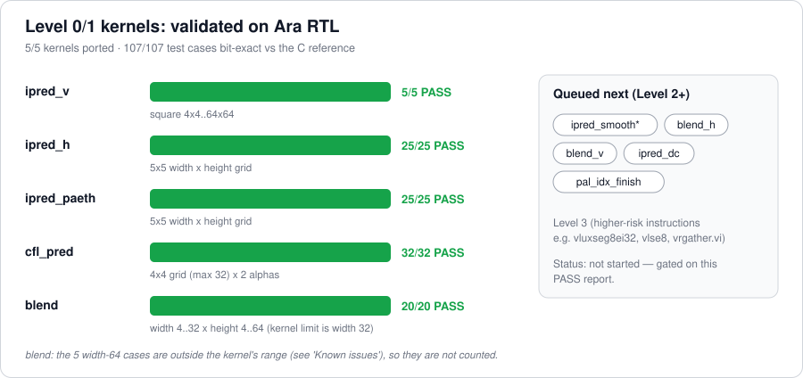
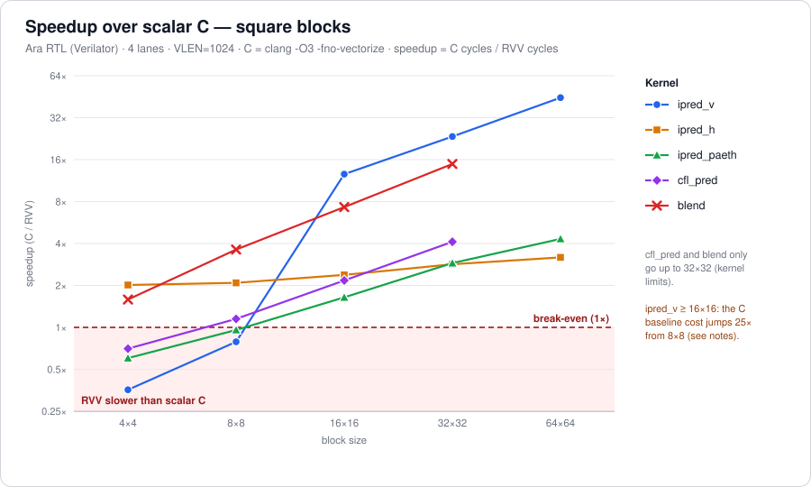
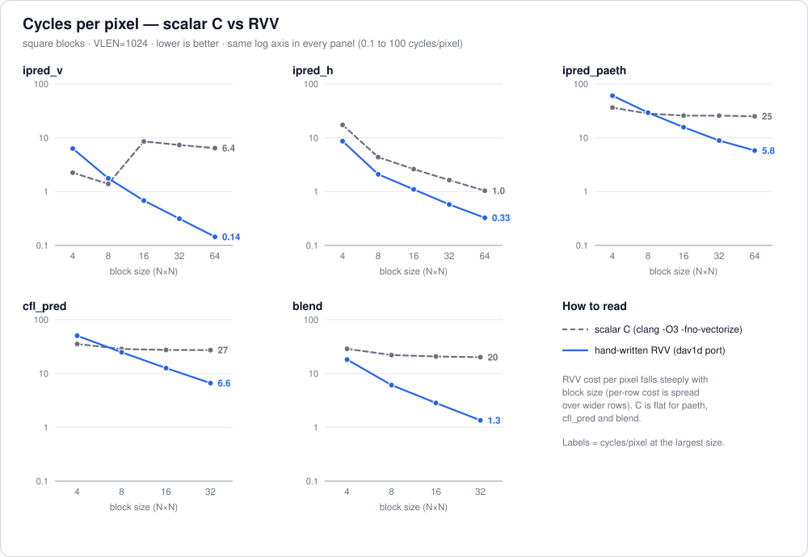
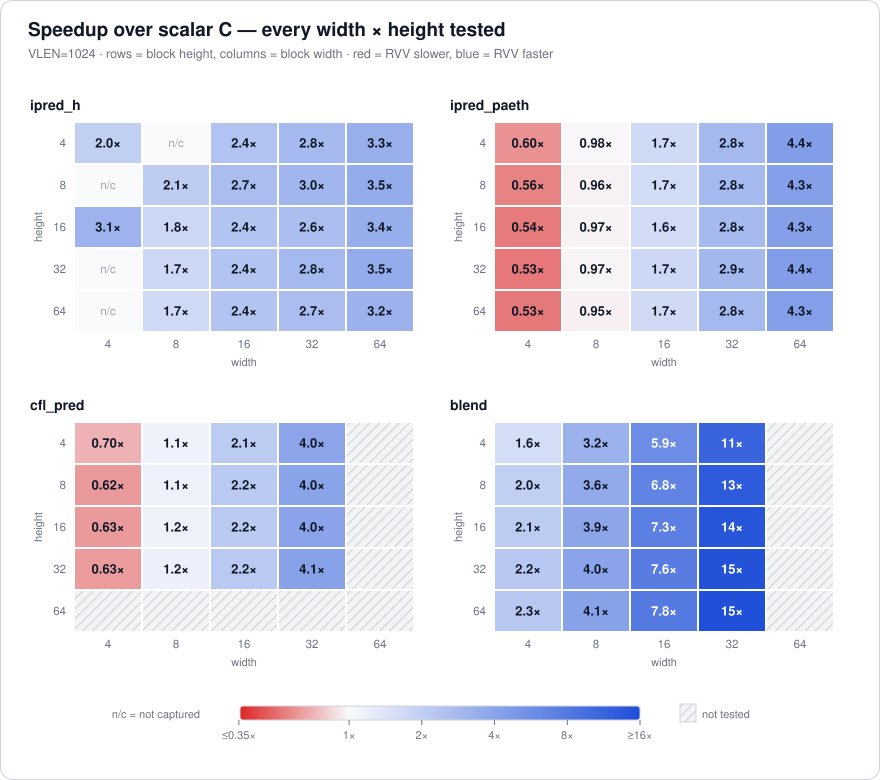
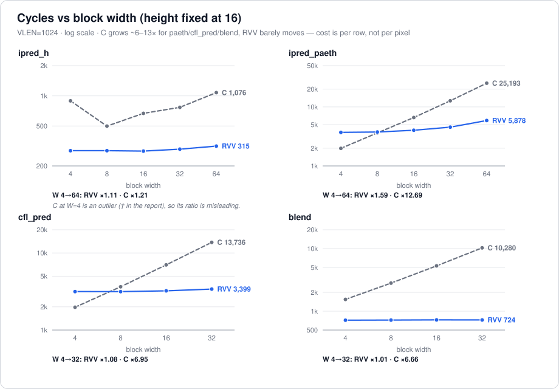
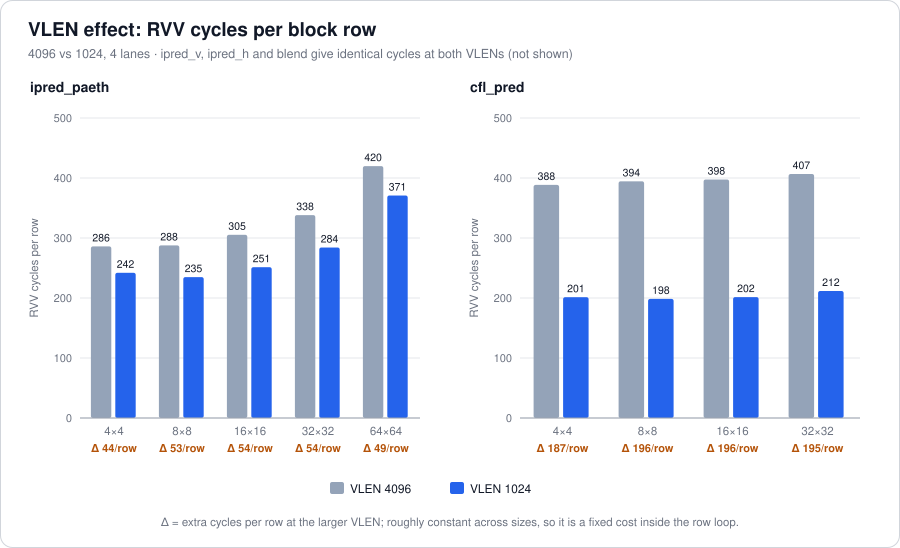

# ARA1D

## Week 2–3 findings Level 0/1 kernels on Ara

**Project:** Closing the Efficiency Gap Between General Purpose RISC V Vector Coprocessors and Fixed Function Video Hardware
**Author:** Mohd Zaid · **Guide:** Prof. Sujay Deb (IIIT Delhi) · **Repo:** [MohdZaid0205/ara1d](https://github.com/MohdZaid0205/ara1d)
**Covers:** Week 2 (extracted kernels) and Week 3 (Ara setup + baseline profiling), Level 0/1 kernels only

> TODO: implement remaining level 2 and 3 functions and their profiling
> 


## Summary

- **All 5 Level 0/1 kernels are ported and verified on Ara RTL:** `ipred_v`, `ipred_h`, `ipred_paeth`, `cfl_pred`, `blend`  **107/107 test cases bit-exact** against the C reference.
- **RVV wins from 16×16 upward on every kernel, but loses on 4×4 for three of five** (VLEN=1024): `ipred_v` 0.36×, `ipred_paeth` 0.60×, `cfl_pred` 0.70×. The per-row cost is not amortised when rows are only 4–8 pixels wide.
- **RVV cost barely depends on block width** (height 16, W 4→32): RVV cycles change by +1% (`blend`), +4% (`ipred_h`), +8% (`cfl_pred`), +23% (`ipred_paeth`), while scalar C grows 6.4–7.0× for those three. Speedup is therefore a function of *width*; RVV pays its cost *per row*.
- **VLEN sensitivity is kernel specific.** `ipred_v`, `ipred_h`, `blend` give identical cycles at VLEN 4096 and 1024. `ipred_paeth` and `cfl_pred` get cheaper at 1024 by a roughly constant amount per row (≈54 and ≈196 cycles/row). Code inspection points at registers being reused at different element widths (hypothesis, §7).

## Setup

| Item | Value |
|---|---|
| Simulator | Ara RTL on Verilator (cycle-accurate) |
| Lanes | 4 |
| VLEN | **1024** (headline, top of the spec's 128–1024 sweep) and 4096 (Ara default, reference only) |
| Timing | `rdcycle` around a single call of each implementation, **one run per case** |
| C baseline | clang `-O3 -fno-vectorize` (scalar by construction) |
| RVV code | hand written assembly ported from dav1d's RVV path (e.g. `src/riscv/64/ipred.S`); Zba/Zbb instructions lowered because Ara lacks them (`sh1add`→`slli`+`add`, `ctz`→small loop in `blend`) |
| Correctness | RVV output compared byte for byte with C output for every case |
| Sweeps | `ipred_v` square 4–64 · `ipred_h`, `ipred_paeth` W,H ∈ {4,8,16,32,64} · `cfl_pred` W,H ∈ {4,8,16,32} × alpha ∈ {−12, +7} · `blend` W ∈ {4,8,16,32}, H ∈ {4,8,16,32,64} |
| Speedup definition | C cycles / RVV cycles (RVV port vs scalar C; the spec's second baseline, existing RVV, is the code measured here) |

> The Week 1 spec bounds the VLEN sweep to **128–1024**, so VLEN=4096 is outside it. It is kept here as a reference because it is Ara's default.

## Results at VLEN = 1024 (square blocks)




| Kernel | Size | C cycles | RVV cycles | Speedup | RVV cyc/px | C cyc/px | Speedup @ VLEN 4096 |
|---|---|---:|---:|---:|---:|---:|---:|
| ipred_v | 4×4 | 36 | 101 | **0.36×** | 6.31 | 2.25 | 0.36× |
|  | 8×8 | 89 | 113 | **0.79×** | 1.77 | 1.39 | 0.79× |
|  | 16×16 | 2,189‡ | 174 | **13×** | 0.68 | 8.55 | 13× |
|  | 32×32 | 7,517‡ | 321 | **23×** | 0.31 | 7.34 | 23× |
|  | 64×64 | 26,320‡ | 591 | **45×** | 0.14 | 6.43 | 45× |
| ipred_h | 4×4 | 278† | 138 | **2.0×** | 8.62 | 17.38 | 2.0× |
|  | 8×8 | 280 | 134 | **2.1×** | 2.09 | 4.38 | 2.1× |
|  | 16×16 | 669 | 281 | **2.4×** | 1.10 | 2.61 | 2.4× |
|  | 32×32 | 1,676 | 590 | **2.8×** | 0.58 | 1.64 | 2.8× |
|  | 64×64 | 4,247 | 1,335 | **3.2×** | 0.33 | 1.04 | 3.2× |
| ipred_paeth | 4×4 | 582 | 968 | **0.60×** | 60.50 | 36.38 | 0.51× |
|  | 8×8 | 1,799 | 1,878 | **0.96×** | 29.34 | 28.11 | 0.78× |
|  | 16×16 | 6,609 | 4,022 | **1.6×** | 15.71 | 25.82 | 1.4× |
|  | 32×32 | 26,310 | 9,094 | **2.9×** | 8.88 | 25.69 | 2.4× |
|  | 64×64 | 102,453 | 23,738 | **4.3×** | 5.80 | 25.01 | 3.8× |
| cfl_pred § | 4×4 | 566 | 806 | **0.70×** | 50.34 | 35.41 | 0.36× |
|  | 8×8 | 1,826 | 1,588 | **1.1×** | 24.81 | 28.53 | 0.58× |
|  | 16×16 | 7,002 | 3,224 | **2.2×** | 12.59 | 27.35 | 1.1× |
|  | 32×32 | 27,896 | 6,775 | **4.1×** | 6.62 | 27.24 | 2.1× |
| blend ¶ | 4×4 | 460 | 290 | **1.6×** | 18.12 | 28.75 | 1.6× |
|  | 8×8 | 1,411 | 390 | **3.6×** | 6.09 | 22.05 | 3.6× |
|  | 16×16 | 5,304 | 726 | **7.3×** | 2.84 | 20.72 | 7.3× |
|  | 32×32 | 20,557 | 1,380 | **15×** | 1.35 | 20.08 | 15× |


**Notes**

- † `ipred_h` C at 4-wide is an outlier: 278 cycles at 4×4 vs 280 at 8×8 (and 891 at 4×16 vs 499 at 8×16). Likely a cold-start or 4-wide code-path effect in the scalar baseline; the 2.0–3.1× speedups at W=4 should not be quoted without checking.
- ‡ `ipred_v` C jumps from 89 cycles at 8×8 to 2,189 at 16×16 (25× for 4× the pixels). The scalar row copy probably changes form at that size (inline stores vs a library call) — check the disassembly. Until then, `ipred_v` speedups ≥ 16×16 mostly measure the baseline.
- § `cfl_pred` cycles are the mean of the two alpha runs (−12 and +7); the RVV cycles are essentially the same for both, only the C cost differs (the sign branch).
- ¶ `blend` is limited to width ≤ 32 (see §8).
- `ipred_h` @ 4×4 is taken from the 4096 table (that cell was missing from the 1024 paste; all 7 comparable `ipred_h` points are identical at both VLENs).

### Cycles per pixel




## Non-square blocks

Speedup is driven mainly by **width**, much less by height (`blend` varies the most with height). For `ipred_paeth` the range across all heights is: W=4: 0.53–0.60×, W=8: 0.95–0.98×, W=16: 1.64–1.73×, W=32: 2.79–2.89×, W=64: 4.29–4.41×.



### Why: cost is per row, not per pixel



Fitting `cycles = fixed + per_row × H` at W=16:

| Kernel (W=16) | RVV fixed cost | RVV per row | C fixed cost | C per row | RVV cycles per row / vector instr. |
|---|---:|---:|---:|---:|---|
| ipred_h | ≈ 0 | 17.7 | ≈ 0 | 41.5 |  |
| ipred_paeth | ≈ 0 | 252.0 | ≈ 0 | 422.3 |  |
| cfl_pred | ≈ 0 | 200.0 | ≈ 0 | 441.3 |  |
| blend | 62 | 41.5 | ≈ 0 | 332.3 | 16 vector instr. per 2 rows → ≈5.2 cycles each |

Fixed costs are within fit error of zero for everything except `blend` (≈ 60 cycles). The whole RVV cost is per row.

For `blend` the loop body issues 16 vector instructions per two rows, so ~42 cycles per row is roughly 5 cycles per vector instruction: with rows of at most 32 bytes on 4 lanes the kernel looks **issue/latency-bound, not throughput-bound**.

## VLEN effect (4096 → 1024)



Comparable data points, identical / different between the two VLENs: `ipred_v` 5/0, `ipred_h` 7/0, `blend` 7/0, `ipred_paeth` 0/9, `cfl_pred` 0/7.

| Kernel | Size | RVV @ 4096 | RVV @ 1024 | Change | Δ cycles/row |
|---|---|---:|---:|---:|---:|
| ipred_paeth | 4×4 | 1,144 | 968 | -15% | 44 |
|  | 8×8 | 2,301 | 1,878 | -18% | 53 |
|  | 16×16 | 4,885 | 4,022 | -18% | 54 |
|  | 32×32 | 10,821 | 9,094 | -16% | 54 |
|  | 64×64 | 26,873 | 23,738 | -12% | 49 |
| cfl_pred | 4×4 | 1,554 | 806 | -48% | 187 |
|  | 8×8 | 3,156 | 1,588 | -50% | 196 |
|  | 16×16 | 6,360 | 3,224 | -49% | 196 |
|  | 32×32 | 13,015 | 6,775 | -48% | 195 |

`cfl_pred` RVV cycles roughly halve and `ipred_paeth` drops about 12–18%, with a per-row saving that is nearly constant across sizes. Because the saving scales with the number of rows and not with the pixels, it is a **fixed cost inside the row loop that grows with VLEN**.


## Reproducing

```bash
# kernels and shared harness
apps/common/rvv_test_common.h            # cycle counter, table printing, buffer compare
apps/{ipred_v,ipred_h,ipred_paeth,cfl_pred,blend}/    # main.c + kernel .S

make -C apps bin/<kernel>                # build; run on Spike first, then Ara RTL
```

Rebuild the hardware model whenever `nr_lanes` or `vlen` changes; then rebuild the apps and run again.

```bash
python3 docs/scripts/make_figures.py     # regenerates docs/figures/*.svg from docs/data/*.csv
```

`docs/data/results.csv` columns: `vlen, kernel, w, h, variant, c_cycles, rvv_cycles, status, source` (`variant` is the alpha for `cfl_pred`; `source` records where a number came from).


