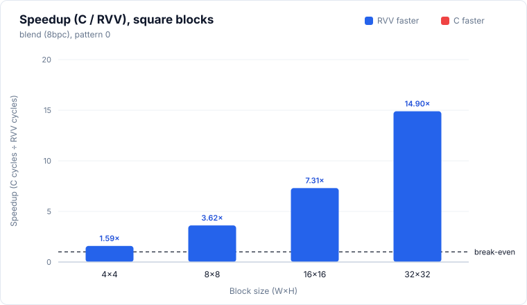
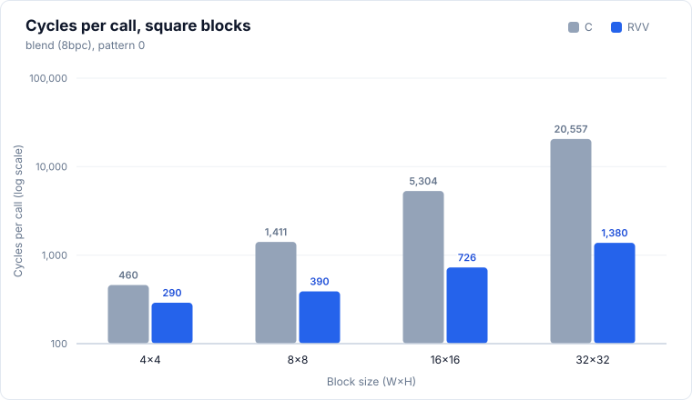
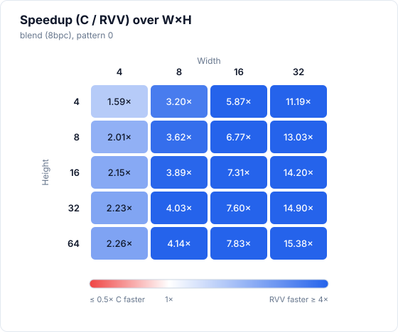
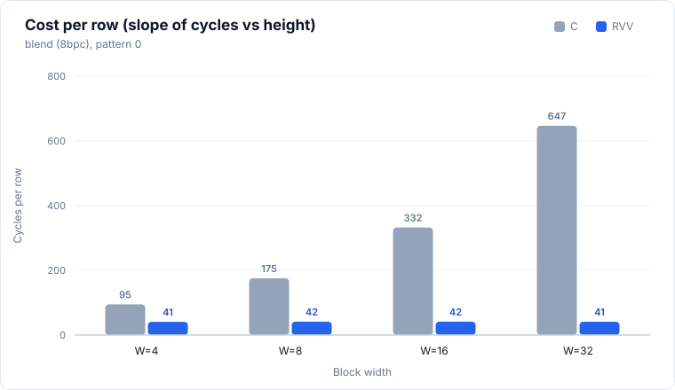

# blend (8bpc)

> Status: **extracted; 20/20 cases bit-exact in the pasted simulation run** (memory model not stated, see Run configuration). Widths 4 to 32 only, no W=64 case in this run.



## Files and build

| File | Purpose |
|---|---|
| `blend.S` | RVV routine, symbol `blend_mock_r`. Ported from dav1d `blend_8bpc_rvv`, with Ara workarounds (see Caveats) |
| `main.c` | scalar reference `blend_mock_c`, harness |
| `res/results.csv` | the pasted results, one row per printed row |

Build and run:

```bash
make -C apps bin/blend
make spike run blend
make simv -app=blend
```

## Harness notes

- Sweep: W in {4, 8, 16, 32}, H in {4, 8, 16, 32, 64} (20 cases), W in the outer loop. `dst_stride = W`; `tmp` and `mask` are contiguous with row length W. W=64 is not in the sweep.
- Blend per pixel: `(dst × (64 − m) + tmp × m + 32) >> 6`.
- Input: `dst` is filled with 180. `tmp[i] = 60 + (i×3) mod 180`. `mask[i] = i mod 65`, so the mask takes every value from 0 to 64 and the blend mixes with a different weight per pixel.
- Pattern: single pattern, the `pattern` column is always 0.
- Preconditions: W is a power of two (the `.S` derives the vector type from `ctz(W)`), H is even (the loop does 2 rows per iteration). All sizes in the sweep satisfy this.
- Vector type: the `.S` sets it from W with `vsetvl zero, a3, t0`, with `vl = W`. For W = 4, 8, 16, 32 this gives LMUL = 1/4, 1/2, 1, 2 at e8, so one row is one vector operation at every width in the sweep.
- Warm-up: none. `main.c` makes one timed C call and one timed RVV call per case.

## Results

### Run configuration

| Item | Value |
|---|---|
| Simulator | Ara RTL on Verilator |
| Lanes | 4 |
| VLEN | 1024 |
| Memory model | not stated |
| Toolchain / flags | clang -O3 -fno-vectorize (C baseline) |
| Date | not stated |
| Harness | one timed call each of C and RVV, no warm-up call |

Level 0/1 numbers taken without a warm-up are not strictly comparable with runs that used one (for example `ipred_smooth`).

### Correctness

**20/20 PASS** (bit-exact against the scalar C reference, single pattern, all 20 sizes).

### Square blocks (headline)

| Size (W×H) | C cycles | RVV cycles | Speedup (C/RVV) | RVV cyc/px | C cyc/px | Status |
|---|---:|---:|---:|---:|---:|---|
| 4×4 | 460 | 290 | 1.59× | 18.12 | 28.75 | PASS |
| 8×8 | 1,411 | 390 | 3.62× | 6.09 | 22.05 | PASS |
| 16×16 | 5,304 | 726 | 7.31× | 2.84 | 20.72 | PASS |
| 32×32 | 20,557 | 1,380 | 14.90× | 1.35 | 20.08 | PASS |

Speedup is C cycles / RVV cycles, bold when below 1. Cycles per pixel is cycles divided by W×H. The figures show the single pattern (0). There is no 64×64 case.




### Rectangular blocks (supplementary)

<details>
<summary>Full table, 16 rows</summary>

| Size (W×H) | C cycles | RVV cycles | Speedup (C/RVV) | RVV cyc/px | C cyc/px | Status |
|---|---:|---:|---:|---:|---:|---|
| 4×8 | 777 | 386 | 2.01× | 12.06 | 24.28 | PASS |
| 4×16 | 1,543 | 718 | 2.15× | 11.22 | 24.11 | PASS |
| 4×32 | 3,075 | 1,382 | 2.23× | 10.80 | 24.02 | PASS |
| 4×64 | 6,120 | 2,710 | 2.26× | 10.59 | 23.91 | PASS |
| 8×4 | 717 | 224 | 3.20× | 7.00 | 22.41 | PASS |
| 8×16 | 2,811 | 722 | 3.89× | 5.64 | 21.96 | PASS |
| 8×32 | 5,592 | 1,386 | 4.03× | 5.41 | 21.84 | PASS |
| 8×64 | 11,240 | 2,714 | 4.14× | 5.30 | 21.95 | PASS |
| 16×4 | 1,339 | 228 | 5.87× | 3.56 | 20.92 | PASS |
| 16×8 | 2,667 | 394 | 6.77× | 3.08 | 20.84 | PASS |
| 16×32 | 10,568 | 1,390 | 7.60× | 2.71 | 20.64 | PASS |
| 16×64 | 21,288 | 2,718 | 7.83× | 2.65 | 20.79 | PASS |
| 32×4 | 2,595 | 232 | 11.19× | 1.81 | 20.27 | PASS |
| 32×8 | 5,160 | 396 | 13.03× | 1.55 | 20.16 | PASS |
| 32×16 | 10,280 | 724 | 14.20× | 1.41 | 20.08 | PASS |
| 32×64 | 41,412 | 2,692 | 15.38× | 1.31 | 20.22 | PASS |

</details>



### Cost per row

Fit of `cycles = fixed + per_row × H` at each width, least squares over all five heights, pattern 0 (the only pattern). Five points per fit, so the fixed terms are only indicative. The C fixed term is negative at W=16 and 32. The RVV fixed term is positive at every width.

| Width | Heights used | C per row | C fixed | RVV per row | RVV fixed |
|---:|---|---:|---:|---:|---:|
| 4 | 4, 8, 16, 32, 64 | 94.86 | 42.46 | 40.89 | 83.17 |
| 8 | 4, 8, 16, 32, 64 | 175.37 | 5.08 | 41.50 | 58.00 |
| 16 | 4, 8, 16, 32, 64 | 332.35 | -8.96 | 41.50 | 62.00 |
| 32 | 4, 8, 16, 32, 64 | 646.94 | -43.29 | 41.00 | 68.00 |



### Observations

- RVV is faster than C in all 20 cases. Smallest speedup is 1.59× (4×4), largest is 15.38× (32×64).
- Square speedup rises with size: 1.59×, 3.62×, 7.31×, 14.90× for 4 to 32.
- RVV cycles do not depend on width once H is fixed. At H=64: 2,710, 2,714, 2,718, 2,692 for W = 4, 8, 16, 32. RVV per row is 40.89 to 41.50 cycles at every width, so it is about 20.5 cycles per row pair.
- C cycles grow with width (per row 94.86, 175.37, 332.35, 646.94 for W = 4, 8, 16, 32), so the speedup grows with width. C stays near 20 to 24 cyc/px at every size.
- RVV 4×4 (290) costs more than 8×4 (224), 16×4 (228) and 32×4 (232), which are larger blocks. It is the first row of the run and there was no warm-up, so it may be a cold-start outlier.
- RVV fixed term is 58 to 83 cycles per call. The `.S` runs a bit-scan loop before the main loop (it iterates ctz(W) times), which is part of every call; the data does not separate it from other fixed costs.
- No non-monotonic C cycles, no missing cells inside the sweep, no non-PASS rows.

### Hypothesis check

> TODO

### Caveats

- One run per case, no repeats, so no run-to-run spread is available.
- Memory model not stated.
- Catalogue entry pending, so no hypotheses are recorded yet.
- W=64 is not in this run, so there is no 64×64 square case and no W=64 fit.
- Ara workarounds in `blend.S`, cost not measured:
  - `ctz(W)` is computed with a scalar loop (Ara has no Zbb).
  - `csrwi vxrm, 2` (round-down) is written before the loop, because Ara drops `vnclipu` rounding for elements ≥ 4 (comment in the `.S`).
- No warm-up call. The first case (4×4) may include cold-start effects.
- The figures and the fit use pattern 0, which is the only pattern.
