# blend_h (8bpc)

> Status: **extracted; 48/48 cases bit-exact in the pasted simulation run** (memory model not stated, see Run configuration).


The figures show one pattern: pattern 1 (the second row of each size in the pasted output).

## Files and build

| File | Purpose |
|---|---|
| `blend_h.S` | RVV routine, symbol `blend_h_mock_r` (not attached, not reviewed for this README) |
| `main.c` | scalar reference, harness (not attached, not reviewed for this README) |
| `res/results.csv` | the pasted results, one row per printed row |

Build and run:

```bash
make -C apps bin/blend_h
make spike run blend_h
make simv -app=blend_h
```

## Harness notes

`main.c` was not attached, so these come from the pasted output only.

- Sweep: W in {4, 8, 16, 32, 64, 128}, H in {4, 8, 16, 32} (24 sizes), H in the outer loop and W in the inner loop. Widths go up to 128; there is no W=64 or larger height, and square sizes stop at 32×32.
- Each size prints twice. Pattern `0` is the first row and pattern `1` the second row of each size. What the two input patterns are: not stated.
- Preconditions, input data and branches exercised: not stated.
- Warm-up: not stated.

## Results

### Run configuration

| Item | Value |
|---|---|
| Simulator | Ara RTL on Verilator |
| Lanes | 4 |
| VLEN | 1024 |
| Memory model | not stated |
| Toolchain / flags | clang -O3 -fno-vectorize (C baseline) |
| Date | not stated |
| Harness | warm-up call not stated |

### Correctness

**48/48 PASS** (bit-exact against the scalar C reference, both patterns, all 24 sizes; the run printed `SUMMARY: 48/48 PASS`).

### Square blocks (headline)

| Size (W×H) | Pattern | C cycles | RVV cycles | Speedup (C/RVV) | RVV cyc/px | C cyc/px | Status |
|---|---|---:|---:|---:|---:|---:|---|
| 4×4 | 0 | 350 | 228 | 1.54× | 14.25 | 21.88 | PASS |
| 4×4 | 1 | 281 | 209 | 1.34× | 13.06 | 17.56 | PASS |
| 8×8 | 0 | 860 | 306 | 2.81× | 4.78 | 13.44 | PASS |
| 8×8 | 1 | 860 | 299 | 2.88× | 4.67 | 13.44 | PASS |
| 16×16 | 0 | 3,072 | 565 | 5.44× | 2.21 | 12.00 | PASS |
| 16×16 | 1 | 3,072 | 583 | 5.27× | 2.28 | 12.00 | PASS |
| 32×32 | 0 | 11,732 | 1,114 | 10.53× | 1.09 | 11.46 | PASS |
| 32×32 | 1 | 11,732 | 1,107 | 10.60× | 1.08 | 11.46 | PASS |

Speedup is C cycles / RVV cycles, bold when below 1. Cycles per pixel is cycles divided by W×H. The figures show pattern 1. Square sizes stop at 32×32.


### Rectangular blocks (supplementary)

<details>
<summary>Full table, 40 rows</summary>

| Size (W×H) | Pattern | C cycles | RVV cycles | Speedup (C/RVV) | RVV cyc/px | C cyc/px | Status |
|---|---|---:|---:|---:|---:|---:|---|
| 8×4 | 0 | 444 | 219 | 2.03× | 6.84 | 13.88 | PASS |
| 8×4 | 1 | 444 | 230 | 1.93× | 7.19 | 13.88 | PASS |
| 16×4 | 0 | 803 | 224 | 3.58× | 3.50 | 12.55 | PASS |
| 16×4 | 1 | 803 | 224 | 3.58× | 3.50 | 12.55 | PASS |
| 32×4 | 0 | 1,498 | 231 | 6.48× | 1.80 | 11.70 | PASS |
| 32×4 | 1 | 1,498 | 231 | 6.48× | 1.80 | 11.70 | PASS |
| 64×4 | 0 | 2,907 | 253 | 11.49× | 0.99 | 11.36 | PASS |
| 64×4 | 1 | 2,907 | 253 | 11.49× | 0.99 | 11.36 | PASS |
| 128×4 | 0 | 5,731 | 418 | 13.71× | 0.82 | 11.19 | PASS |
| 128×4 | 1 | 5,731 | 414 | 13.84× | 0.81 | 11.19 | PASS |
| 4×8 | 0 | 495 | 299 | 1.66× | 9.34 | 15.47 | PASS |
| 4×8 | 1 | 495 | 301 | 1.64× | 9.41 | 15.47 | PASS |
| 16×8 | 0 | 1,555 | 322 | 4.83× | 2.52 | 12.15 | PASS |
| 16×8 | 1 | 1,555 | 304 | 5.12× | 2.38 | 12.15 | PASS |
| 32×8 | 0 | 2,958 | 318 | 9.30× | 1.24 | 11.55 | PASS |
| 32×8 | 1 | 2,958 | 318 | 9.30× | 1.24 | 11.55 | PASS |
| 64×8 | 0 | 5,782 | 352 | 16.43× | 0.69 | 11.29 | PASS |
| 64×8 | 1 | 5,782 | 345 | 16.76× | 0.67 | 11.29 | PASS |
| 128×8 | 0 | 11,426 | 616 | 18.55× | 0.60 | 11.16 | PASS |
| 128×8 | 1 | 11,426 | 612 | 18.67× | 0.60 | 11.16 | PASS |
| 4×16 | 0 | 962 | 580 | 1.66× | 9.06 | 15.03 | PASS |
| 4×16 | 1 | 962 | 575 | 1.67× | 8.98 | 15.03 | PASS |
| 8×16 | 0 | 1,669 | 567 | 2.94× | 4.43 | 13.04 | PASS |
| 8×16 | 1 | 1,669 | 560 | 2.98× | 4.38 | 13.04 | PASS |
| 32×16 | 0 | 5,884 | 572 | 10.29× | 1.12 | 11.49 | PASS |
| 32×16 | 1 | 5,884 | 572 | 10.29× | 1.12 | 11.49 | PASS |
| 64×16 | 0 | 11,516 | 655 | 17.58× | 0.64 | 11.25 | PASS |
| 64×16 | 1 | 11,516 | 655 | 17.58× | 0.64 | 11.25 | PASS |
| 128×16 | 0 | 22,784 | 1,216 | 18.74× | 0.59 | 11.12 | PASS |
| 128×16 | 1 | 22,784 | 1,212 | 18.80× | 0.59 | 11.12 | PASS |
| 4×32 | 0 | 1,873 | 1,091 | 1.72× | 8.52 | 14.63 | PASS |
| 4×32 | 1 | 1,873 | 1,086 | 1.72× | 8.48 | 14.63 | PASS |
| 8×32 | 0 | 3,300 | 1,082 | 3.05× | 4.23 | 12.89 | PASS |
| 8×32 | 1 | 3,300 | 1,089 | 3.03× | 4.25 | 12.89 | PASS |
| 16×32 | 0 | 6,112 | 1,105 | 5.53× | 2.16 | 11.94 | PASS |
| 16×32 | 1 | 6,112 | 1,094 | 5.59× | 2.14 | 11.94 | PASS |
| 64×32 | 0 | 22,988 | 1,269 | 18.12× | 0.62 | 11.22 | PASS |
| 64×32 | 1 | 22,988 | 1,262 | 18.22× | 0.62 | 11.22 | PASS |
| 128×32 | 0 | 45,880 | 2,430 | 18.88× | 0.59 | 11.20 | PASS |
| 128×32 | 1 | 46,021 | 2,446 | 18.81× | 0.60 | 11.24 | PASS |

</details>



### Cost per row

Fit of `cycles = fixed + per_row × H` at each width, least squares over all four heights (4, 8, 16, 32), using the pattern-1 rows, the same pattern as the figures. Four points per fit, so the fixed terms are only indicative. The C fixed term is negative at W=128. The RVV fixed term is positive at every width.

| Width | Heights used | C per row | C fixed | RVV per row | RVV fixed |
|---:|---|---:|---:|---:|---:|
| 4 | 4, 8, 16, 32 | 57.06 | 46.87 | 31.81 | 65.65 |
| 8 | 4, 8, 16, 32 | 101.88 | 40.04 | 31.41 | 73.30 |
| 16 | 4, 8, 16, 32 | 189.69 | 40.13 | 31.72 | 75.52 |
| 32 | 4, 8, 16, 32 | 365.53 | 35.04 | 31.79 | 80.13 |
| 64 | 4, 8, 16, 32 | 717.09 | 41.91 | 36.76 | 77.30 |
| 128 | 4, 8, 16, 32 | 1439.39 | -100.30 | 73.82 | 63.74 |


### Observations

- RVV is faster than C in all 48 rows, so there is no speedup crossover. Smallest speedup is 1.34× (4×4, pattern 1), largest is 18.88× (128×32, pattern 0).
- Speedup grows with width: 1.34× to 1.72× at W=4, 1.93× to 3.05× at W=8, 3.58× to 5.59× at W=16, 6.48× to 10.60× at W=32, 11.49× to 18.22× at W=64, 13.71× to 18.88× at W=128. Square speedup (pattern 0 / pattern 1) is 1.54× / 1.34×, 2.81× / 2.88×, 5.44× / 5.27×, 10.53× / 10.60× for 4 to 32.
- At fixed width the speedup rises with height. From W=64 to W=128 the gain is smaller than from earlier width doublings.
- RVV cost per row is about 31.4 to 31.8 cycles for W = 4 to 32, 36.76 at W=64 and 73.82 at W=128. The RVV fixed term is 63.74 to 80.13 cycles. At H=32 the RVV cycles are 1,086, 1,089, 1,094, 1,107, 1,262, 2,446 for W = 4, 8, 16, 32, 64, 128. The step between W=64 and W=128 is where RVV cost per row doubles. The cause is not shown by this data.
- C cost per row is roughly proportional to width (57.06, 101.88, 189.69, 365.53, 717.09, 1439.39 for W = 4 to 128), 11.12 to 13.88 cyc/px for W ≥ 8 and 14.63 to 21.88 at W=4.
- Both patterns give identical C cycles at 22 of the 24 sizes. C differs at 4×4 (350 against 281) and 128×32 (45,880 against 46,021).
- RVV cycles differ between the two patterns at 18 of the 24 sizes, by up to 19 cycles, with no consistent direction (8×4: 219 against 230; 128×4: 418 against 414). No data-dependent cause can be named from this data.
- RVV 4×4 pattern 0 (228) costs more than 8×4 pattern 0 (219) and 16×4 (224), which are larger blocks. RVV 4×4 pattern 1 (209) does not.
- No missing cells, no non-PASS rows.

### Hypothesis check

> TODO

### Caveats

- One run per case, no repeats, so no run-to-run spread is available.
- Memory model not stated.
- `blend_h.S` and `main.c` were not attached, so there is no catalogue entry, no hypotheses, and the pattern meanings, harness preconditions, warm-up and Ara workarounds are not stated.
- The figures and the fit use pattern 1.
