# blend_v (8bpc)

> Status: **extracted; 48/48 cases bit-exact in the pasted simulation run** (memory model not stated, see Run configuration).


The figures show one pattern: pattern 1 (the second row of each size in the pasted output).

## Files and build

| File | Purpose |
|---|---|
| `blend_v.S` | RVV routine, symbol `blend_v_mock_r` (not attached, not reviewed for this README) |
| `main.c` | scalar reference `blend_v_mock_c`, harness (only `main()` was attached; `init_inputs` was not seen) |
| `res/results.csv` | the pasted results, one row per printed row |

Build and run:

```bash
make -C apps bin/blend_v
make spike run blend_v
make simv -app=blend_v
```

## Harness notes

- Sweep: W in {4, 8, 16, 32}, H in {4, 8, 16, 32, 64, 128} (24 sizes), W in the outer loop. `stride = W`. Heights go up to 128; there is no W=64 case.
- Each size runs twice, pattern 0 then pattern 1, with inputs from `init_inputs(w, h, pattern)`. What the two patterns are: not stated (`init_inputs` was not attached).
- Each call takes `(dst, stride, tmp, w, h)`. Before every call the destination buffer is restored from `dst_init_buf`, so C and RVV start from the same destination contents.
- Preconditions and branches exercised: not stated.
- Warm-up: yes. One discarded call of C and one of RVV on a scratch buffer (restored from `dst_init_buf` before each), then one timed call each.

## Results

### Run configuration

| Item | Value |
|---|---|
| Simulator | Ara RTL on Verilator |
| Lanes | 4 |
| VLEN | 1024 |
| Memory model | not stated |
| Toolchain / flags | clang -O3 -fno-vectorize (C baseline) |
| Date | not stated |
| Harness | one discarded warm-up call each of C and RVV, then one timed call each |

### Correctness

**48/48 PASS** (bit-exact against the scalar C reference, both patterns, all 24 sizes).

### Square blocks (headline)

| Size (W×H) | Pattern | C cycles | RVV cycles | Speedup (C/RVV) | RVV cyc/px | C cyc/px | Status |
|---|---|---:|---:|---:|---:|---:|---|
| 4×4 | 0 | 386 | 212 | 1.82× | 13.25 | 24.12 | PASS |
| 4×4 | 1 | 306 | 183 | 1.67× | 11.44 | 19.12 | PASS |
| 8×8 | 0 | 969 | 317 | 3.06× | 4.95 | 15.14 | PASS |
| 8×8 | 1 | 969 | 317 | 3.06× | 4.95 | 15.14 | PASS |
| 16×16 | 0 | 3,555 | 581 | 6.12× | 2.27 | 13.89 | PASS |
| 16×16 | 1 | 3,555 | 581 | 6.12× | 2.27 | 13.89 | PASS |
| 32×32 | 0 | 13,678 | 1,092 | 12.53× | 1.07 | 13.36 | PASS |
| 32×32 | 1 | 13,678 | 1,092 | 12.53× | 1.07 | 13.36 | PASS |

Speedup is C cycles / RVV cycles, bold when below 1. Cycles per pixel is cycles divided by W×H. The figures show pattern 1. Square sizes stop at 32×32.


### Rectangular blocks (supplementary)

<details>
<summary>Full table, 40 rows</summary>

| Size (W×H) | Pattern | C cycles | RVV cycles | Speedup (C/RVV) | RVV cyc/px | C cyc/px | Status |
|---|---|---:|---:|---:|---:|---:|---|
| 4×8 | 0 | 561 | 313 | 1.79× | 9.78 | 17.53 | PASS |
| 4×8 | 1 | 561 | 313 | 1.79× | 9.78 | 17.53 | PASS |
| 4×16 | 0 | 1,105 | 573 | 1.93× | 8.95 | 17.27 | PASS |
| 4×16 | 1 | 1,105 | 573 | 1.93× | 8.95 | 17.27 | PASS |
| 4×32 | 0 | 2,193 | 1,093 | 2.01× | 8.54 | 17.13 | PASS |
| 4×32 | 1 | 2,193 | 1,093 | 2.01× | 8.54 | 17.13 | PASS |
| 4×64 | 0 | 4,371 | 2,133 | 2.05× | 8.33 | 17.07 | PASS |
| 4×64 | 1 | 4,371 | 2,133 | 2.05× | 8.33 | 17.07 | PASS |
| 4×128 | 0 | 8,740 | 4,213 | 2.07× | 8.23 | 17.07 | PASS |
| 4×128 | 1 | 8,740 | 4,213 | 2.07× | 8.23 | 17.07 | PASS |
| 8×4 | 0 | 493 | 187 | 2.64× | 5.84 | 15.41 | PASS |
| 8×4 | 1 | 493 | 187 | 2.64× | 5.84 | 15.41 | PASS |
| 8×16 | 0 | 1,921 | 577 | 3.33× | 4.51 | 15.01 | PASS |
| 8×16 | 1 | 1,921 | 577 | 3.33× | 4.51 | 15.01 | PASS |
| 8×32 | 0 | 3,827 | 1,097 | 3.49× | 4.29 | 14.95 | PASS |
| 8×32 | 1 | 3,827 | 1,097 | 3.49× | 4.29 | 14.95 | PASS |
| 8×64 | 0 | 7,652 | 2,137 | 3.58× | 4.17 | 14.95 | PASS |
| 8×64 | 1 | 7,652 | 2,137 | 3.58× | 4.17 | 14.95 | PASS |
| 8×128 | 0 | 15,295 | 4,217 | 3.63× | 4.12 | 14.94 | PASS |
| 8×128 | 1 | 15,295 | 4,217 | 3.63× | 4.12 | 14.94 | PASS |
| 16×4 | 0 | 901 | 191 | 4.72× | 2.98 | 14.08 | PASS |
| 16×4 | 1 | 901 | 191 | 4.72× | 2.98 | 14.08 | PASS |
| 16×8 | 0 | 1,785 | 321 | 5.56× | 2.51 | 13.95 | PASS |
| 16×8 | 1 | 1,785 | 321 | 5.56× | 2.51 | 13.95 | PASS |
| 16×32 | 0 | 7,108 | 1,101 | 6.46× | 2.15 | 13.88 | PASS |
| 16×32 | 1 | 7,108 | 1,101 | 6.46× | 2.15 | 13.88 | PASS |
| 16×64 | 0 | 14,207 | 2,141 | 6.64× | 2.09 | 13.87 | PASS |
| 16×64 | 1 | 14,207 | 2,141 | 6.64× | 2.09 | 13.87 | PASS |
| 16×128 | 0 | 28,351 | 4,221 | 6.72× | 2.06 | 13.84 | PASS |
| 16×128 | 1 | 28,351 | 4,221 | 6.72× | 2.06 | 13.84 | PASS |
| 32×4 | 0 | 1,717 | 196 | 8.76× | 1.53 | 13.41 | PASS |
| 32×4 | 1 | 1,717 | 196 | 8.76× | 1.53 | 13.41 | PASS |
| 32×8 | 0 | 3,419 | 324 | 10.55× | 1.27 | 13.36 | PASS |
| 32×8 | 1 | 3,419 | 324 | 10.55× | 1.27 | 13.36 | PASS |
| 32×16 | 0 | 6,836 | 580 | 11.79× | 1.13 | 13.35 | PASS |
| 32×16 | 1 | 6,836 | 580 | 11.79× | 1.13 | 13.35 | PASS |
| 32×64 | 0 | 27,278 | 2,116 | 12.89× | 1.03 | 13.32 | PASS |
| 32×64 | 1 | 27,278 | 2,116 | 12.89× | 1.03 | 13.32 | PASS |
| 32×128 | 0 | 54,992 | 4,164 | 13.21× | 1.02 | 13.43 | PASS |
| 32×128 | 1 | 54,981 | 4,164 | 13.20× | 1.02 | 13.42 | PASS |

</details>



### Cost per row

Fit of `cycles = fixed + per_row × H` at each width, least squares over all six heights, using the pattern-1 rows, the same pattern as the figures. Six points per fit, so the fixed terms are only indicative. The C fixed term is negative at W=32. The RVV fixed term is positive at every width.

| Width | Heights used | C per row | C fixed | RVV per row | RVV fixed |
|---:|---|---:|---:|---:|---:|
| 4 | 4, 8, 16, 32, 64, 128 | 68.09 | 19.48 | 32.50 | 53.00 |
| 8 | 4, 8, 16, 32, 64, 128 | 119.39 | 11.92 | 32.50 | 57.00 |
| 16 | 4, 8, 16, 32, 64, 128 | 221.42 | 18.20 | 32.50 | 61.00 |
| 32 | 4, 8, 16, 32, 64, 128 | 429.32 | -46.79 | 32.00 | 68.00 |


### Observations

- RVV is faster than C in all 48 rows, so there is no speedup crossover. Smallest speedup is 1.67× (4×4, pattern 1), largest is 13.21× (32×128, pattern 0).
- Speedup grows with width: 1.67× to 2.07× at W=4, 2.64× to 3.63× at W=8, 4.72× to 6.72× at W=16, 8.76× to 13.21× at W=32. Square speedup is 1.82× (4×4, pattern 0; 1.67× pattern 1), 3.06×, 6.12×, 12.53× for 4 to 32.
- Speedup also rises with height at each width, then levels off. The one dip is 4×4 pattern 0 (1.82×) to 4×8 (1.79×). At W=32 it is 8.76× at H=4 and 13.21× at H=128 (pattern 0).
- RVV cost per row is about the same at every width: 32.50, 32.50, 32.50, 32.00 cycles for W = 4, 8, 16, 32. The RVV fixed term grows with width instead (53.00, 57.00, 61.00, 68.00). At H=128 the RVV cycles are 4,213, 4,217, 4,221 and 4,164 for W = 4, 8, 16, 32.
- C cost per row grows with width (68.09, 119.39, 221.42, 429.32), about 13.3 to 15.4 cyc/px for W ≥ 8 and up to 24.12 at 4×4.
- Both patterns give identical cycles at 22 of the 24 sizes. Two sizes differ: 4×4 (C 386 against 306, RVV 212 against 183) and 32×128 (C 54,992 against 54,981, RVV equal). A warm-up call was used, so the 4×4 difference is not an obvious cold-start effect. The cause is not shown by this data.
- RVV 4×4 pattern 0 (212) costs more than 8×4 (187), 16×4 (191) and 32×4 (196), which are larger blocks. RVV 4×4 pattern 1 (183) does not.
- No missing cells, no non-PASS rows.

### Hypothesis check

> TODO

### Caveats

- One run per case, no repeats, so no run-to-run spread is available.
- Memory model not stated.
- `blend_v.S` and the rest of `main.c` were not attached, so there is no catalogue entry, no hypotheses, and the pattern meanings, harness preconditions and Ara workarounds are not stated.
- The figures and the fit use pattern 1.
