# cfl_pred (8bpc)

> Status: **extracted; 28/28 cases bit-exact in the pasted simulation run** (memory model not stated, see Run configuration). 4 of the 32 swept cases are not in the pasted CSV (4×32 and 32×4, see Harness notes).


The figures show one pattern: pattern 1 (alpha +7).

## Files and build

| File | Purpose |
|---|---|
| `cfl_pred.S` | RVV routine, symbol `cfl_pred_mock_r`. Ported from dav1d `cfl_pred_8bpc_rvv`, with Ara changes (see Caveats) |
| `main.c` | scalar reference `cfl_pred_mock_c`, harness |
| `res/results.csv` | the pasted results, one row per printed row |

Build and run:

```bash
make -C apps bin/cfl_pred
make spike run cfl_pred
make simv -app=cfl_pred
```

## Harness notes

- Sweep in `main.c`: W, H in {4, 8, 16, 32}, W in the outer loop, then two alphas per size (32 rows). Max block is 32×32 (`main.c`: CfL only runs on blocks up to 32×32 in AV1).
- The pasted CSV has 28 rows. 4×32 and 32×4 (two rows each) are not in it. The harness sweeps them, so they were not pasted or the run was cut. Nothing in the CSV shows which.
- Pattern column: `0` = alpha -12, `1` = alpha +7, in this order for every size. One negative and one positive alpha exercise both branches of the sign handling.
- Input: `dc = 128`. `ac[i] = (i odd ? +1 : -1) × (4 + i mod 24)`, a zero-mean-ish alternating ramp, stored row after row with row length W. `dst` is filled with 128 before each call, `stride = W`.
- Preconditions: `ac` is contiguous with row length W (the `.S` advances `ac` by the vector length it processes).
- Row processing: the `.S` handles one row per outer iteration and splits a row into chunks with `vsetvli e16, m2`. With VLEN 1024 a chunk holds 128 elements, so every width in the sweep is one chunk per row.
- Warm-up: none. `main.c` makes one timed C call and one timed RVV call per case.

## Results

### Run configuration

| Item | Value |
|---|---|
| Simulator | Ara RTL on Verilator |
| Lanes | 4 |
| VLEN | 1024 |
| Memory model | not stated |
| Toolchain / flags | clang -O3 -fno-vectorize (C baseline) |
| Date | not stated |
| Harness | one timed call each of C and RVV, no warm-up call |

Level 0/1 numbers taken without a warm-up are not strictly comparable with runs that used one (for example `ipred_smooth`).

### Correctness

**28/28 PASS** (bit-exact against the scalar C reference, both alphas, 14 sizes).

### Square blocks (headline)

| Size (W×H) | Pattern | C cycles | RVV cycles | Speedup (C/RVV) | RVV cyc/px | C cyc/px | Status |
|---|---|---:|---:|---:|---:|---:|---|
| 4×4 | alpha -12 | 658 | 848 | **0.78×** | 53.00 | 41.12 | PASS |
| 4×4 | alpha +7 | 524 | 819 | **0.64×** | 51.19 | 32.75 | PASS |
| 8×8 | alpha -12 | 1,803 | 1,616 | 1.12× | 25.25 | 28.17 | PASS |
| 8×8 | alpha +7 | 1,772 | 1,616 | 1.10× | 25.25 | 27.69 | PASS |
| 16×16 | alpha -12 | 6,947 | 3,284 | 2.12× | 12.83 | 27.14 | PASS |
| 16×16 | alpha +7 | 6,870 | 3,284 | 2.09× | 12.83 | 26.84 | PASS |
| 32×32 | alpha -12 | 27,857 | 6,899 | 4.04× | 6.74 | 27.20 | PASS |
| 32×32 | alpha +7 | 27,266 | 6,899 | 3.95× | 6.74 | 26.63 | PASS |

Speedup is C cycles / RVV cycles, bold when below 1. Cycles per pixel is cycles divided by W×H. The figures show pattern 1 (alpha +7).


### Rectangular blocks (supplementary)

<details>
<summary>Full table, 20 rows</summary>

| Size (W×H) | Pattern | C cycles | RVV cycles | Speedup (C/RVV) | RVV cyc/px | C cyc/px | Status |
|---|---|---:|---:|---:|---:|---:|---|
| 4×8 | alpha -12 | 977 | 1,618 | **0.60×** | 50.56 | 30.53 | PASS |
| 4×8 | alpha +7 | 948 | 1,618 | **0.59×** | 50.56 | 29.62 | PASS |
| 4×16 | alpha -12 | 1,985 | 3,216 | **0.62×** | 50.25 | 31.02 | PASS |
| 4×16 | alpha +7 | 1,953 | 3,216 | **0.61×** | 50.25 | 30.52 | PASS |
| 8×4 | alpha -12 | 919 | 818 | 1.12× | 25.56 | 28.72 | PASS |
| 8×4 | alpha +7 | 929 | 818 | 1.14× | 25.56 | 29.03 | PASS |
| 8×16 | alpha -12 | 3,622 | 3,212 | 1.13× | 25.09 | 28.30 | PASS |
| 8×16 | alpha +7 | 3,545 | 3,212 | 1.10× | 25.09 | 27.70 | PASS |
| 8×32 | alpha -12 | 7,529 | 6,404 | 1.18× | 25.02 | 29.41 | PASS |
| 8×32 | alpha +7 | 7,322 | 6,404 | 1.14× | 25.02 | 28.60 | PASS |
| 16×4 | alpha -12 | 1,798 | 836 | 2.15× | 13.06 | 28.09 | PASS |
| 16×4 | alpha +7 | 1,738 | 836 | 2.08× | 13.06 | 27.16 | PASS |
| 16×8 | alpha -12 | 3,540 | 1,652 | 2.14× | 12.91 | 27.66 | PASS |
| 16×8 | alpha +7 | 3,490 | 1,652 | 2.11× | 12.91 | 27.27 | PASS |
| 16×32 | alpha -12 | 13,951 | 6,548 | 2.13× | 12.79 | 27.25 | PASS |
| 16×32 | alpha +7 | 13,641 | 6,548 | 2.08× | 12.79 | 26.64 | PASS |
| 32×8 | alpha -12 | 6,974 | 1,739 | 4.01× | 6.79 | 27.24 | PASS |
| 32×8 | alpha +7 | 6,877 | 1,739 | 3.95× | 6.79 | 26.86 | PASS |
| 32×16 | alpha -12 | 13,762 | 3,459 | 3.98× | 6.76 | 26.88 | PASS |
| 32×16 | alpha +7 | 13,569 | 3,459 | 3.92× | 6.76 | 26.50 | PASS |

</details>



### Cost per row

Fit of `cycles = fixed + per_row × H` at each width that has at least three heights, using the pattern-1 (alpha +7) rows, the same pattern as the figures. Three to four points per fit, so the fixed terms are only indicative. The C fixed term is negative at W=8. The RVV fixed term is positive at every width.

| Width | Heights used | C per row | C fixed | RVV per row | RVV fixed |
|---:|---|---:|---:|---:|---:|
| 4 | 4, 8, 16 | 120.02 | 21.50 | 199.75 | 20.00 |
| 8 | 4, 8, 16, 32 | 229.12 | -44.83 | 199.50 | 20.00 |
| 16 | 4, 8, 16, 32 | 424.39 | 68.91 | 204.00 | 20.00 |
| 32 | 8, 16, 32 | 850.47 | 28.50 | 215.00 | 19.00 |


### Observations

- RVV is slower than C at every W=4 size (0.59× to 0.78×). It is faster at W ≥ 8: 1.10× to 1.18× at W=8, 2.08× to 2.15× at W=16, 3.92× to 4.04× at W=32. The speedup crosses 1.0 between W=4 and W=8.
- At fixed width the speedup barely changes with height. The speedup is set by width.
- RVV cycles are identical for both alphas in every case. C cycles differ by about 1 to 4 %, with alpha -12 higher in most rows (8×4 is the reverse: 919 against 929).
- RVV cost per row is about 200 cycles at W=4 and W=8 (199.75, 199.50), 204 at W=16 and 215 at W=32. RVV cycles for 4×H and 8×H are nearly the same (4×16: 3,216, 8×16: 3,212). RVV cyc/px is about 50 at W=4, 25 at W=8, 13 at W=16 and 6.8 at W=32.
- C cost per row grows with width (120.02, 229.12, 424.39, 850.47 for W = 4, 8, 16, 32), between 26.50 and 32.75 cyc/px at every size except 4×4 alpha -12 (41.12).
- 4×4 is the first row of the run and there was no warm-up. Its C cycles differ by 134 between the two alphas (658, 524), far more than at other sizes, and RVV alpha -12 (848) is above 8×4 (818) and above its own alpha +7 row (819). Possible cold-start effect on the first rows.
- Missing cells: 4×32 and 32×4 are not in the CSV. W=4 and W=32 fits use three heights only.
- No non-PASS rows.

### Hypothesis check

> TODO

### Caveats

- One run per case, no repeats, so no run-to-run spread is available.
- Memory model not stated.
- Catalogue entry pending, so no hypotheses are recorded yet.
- 4×32 and 32×4 are swept by `main.c` but not in the CSV.
- Ara changes in `cfl_pred.S`, cost not measured:
  - `sh1add` (Zba) is replaced by `slli` + `add`.
  - An explicit `vmin.vx` clip to 255 is added, with `li t5, 255` before the loop.
  - `vxrm` is set to 2 (round-down) before the shift-0 narrowing and back to 0 before the next `vssra`. The narrowing is two `vnclipu.wi` steps, e32 to e16 to e8, each preceded by a `vsetvli`.
- Each row chunk runs four `vsetvli` (e16 m2, e32 m4, e16 m2, e8 m1) and two `csrwi vxrm`. Their share of the per-row cost was not measured.
- No warm-up call. The first case (4×4) may include cold-start effects.
- The figures and the fit use pattern 1 (alpha +7).
