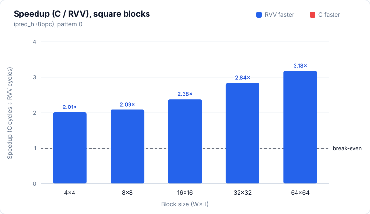
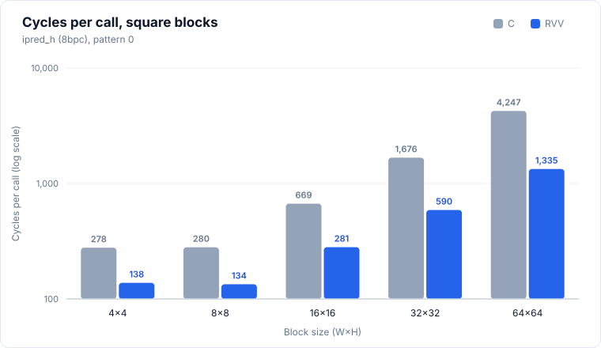
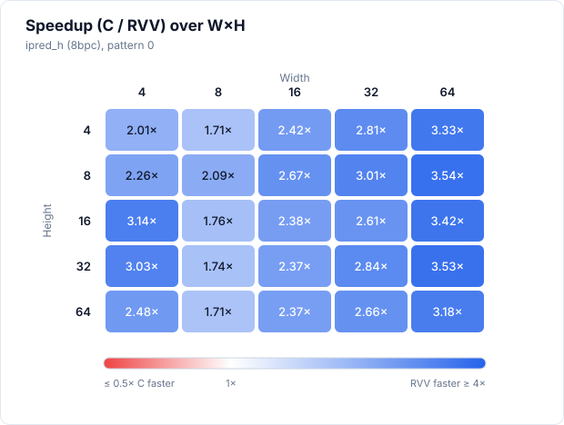

# ipred_h (8bpc)

> Status: **extracted; 25/25 cases bit-exact in the pasted simulation run** (memory model not stated, see Run configuration).



## Files and build

| File | Purpose |
|---|---|
| `ipred_h.S` | RVV routine, symbol `ipred_h_mock_r`. Ported from dav1d `ipred_h_8bpc_rvv`; the Zba `sh1add`/`sh2add` ops are lowered to `slli` + `add` through scratch register `t0` |
| `main.c` | scalar reference `ipred_h_mock_c`, harness |
| `res/results.csv` | the pasted results, one row per printed row |

Build and run:

```bash
make -C apps bin/ipred_h
make spike run ipred_h
make simv -app=ipred_h
```

## Harness notes

- Sweep: every W×H combination with W, H in {4, 8, 16, 32, 64} (25 cases), W in the outer loop, H in the inner loop. `stride = W`.
- Input: the left column is a ramp, `topleft_buf[i] = 30 + i×11` (mod 256), read as `topleft[-(1+y)]` for row y, so every output row has a distinct value.
- Pattern: single pattern, the `pattern` column is always 0.
- Preconditions: H is a multiple of 4 (from the `.S` header). All heights in the sweep satisfy this.
- Paths in the `.S`: H = 4 takes a separate straight-line block (label `4`, no loop). H ≥ 8 takes the main loop (label `3`), 4 rows per iteration. Width goes through an LMUL 1, then 2, then 4 fallback chain. With VLEN 1024 and e8, LMUL=1 already holds 128 elements, so every width in the sweep (max 64) stays at LMUL=1 and the fallback is not exercised.
- Warm-up: none. `main.c` makes one timed C call and one timed RVV call per case.
- Output buffers are zeroed before each case.

## Results

### Run configuration

| Item | Value |
|---|---|
| Simulator | Ara RTL on Verilator |
| Lanes | 4 |
| VLEN | 1024 |
| Memory model | not stated |
| Toolchain / flags | clang -O3 -fno-vectorize (C baseline) |
| Date | not stated |
| Harness | one timed call each of C and RVV, no warm-up call |

Level 0/1 numbers taken without a warm-up are not strictly comparable with runs that used one (for example `ipred_smooth`).

### Correctness

**25/25 PASS** (bit-exact against the scalar C reference, single pattern, all 25 sizes).

### Square blocks (headline)

| Size (W×H) | C cycles | RVV cycles | Speedup (C/RVV) | RVV cyc/px | C cyc/px | Status |
|---|---:|---:|---:|---:|---:|---|
| 4×4 | 278 | 138 | 2.01× | 8.62 | 17.38 | PASS |
| 8×8 | 280 | 134 | 2.09× | 2.09 | 4.38 | PASS |
| 16×16 | 669 | 281 | 2.38× | 1.10 | 2.61 | PASS |
| 32×32 | 1,676 | 590 | 2.84× | 0.58 | 1.64 | PASS |
| 64×64 | 4,247 | 1,335 | 3.18× | 0.33 | 1.04 | PASS |

Speedup is C cycles / RVV cycles, bold when below 1. Cycles per pixel is cycles divided by W×H. The figures show the single pattern (0).




### Rectangular blocks (supplementary)

<details>
<summary>Full table, 20 rows</summary>

| Size (W×H) | C cycles | RVV cycles | Speedup (C/RVV) | RVV cyc/px | C cyc/px | Status |
|---|---:|---:|---:|---:|---:|---|
| 4×8 | 470 | 208 | 2.26× | 6.50 | 14.69 | PASS |
| 4×16 | 891 | 284 | 3.14× | 4.44 | 13.92 | PASS |
| 4×32 | 1,734 | 573 | 3.03× | 4.48 | 13.55 | PASS |
| 4×64 | 2,815 | 1,133 | 2.48× | 4.43 | 11.00 | PASS |
| 8×4 | 137 | 80 | 1.71× | 2.50 | 4.28 | PASS |
| 8×16 | 499 | 284 | 1.76× | 2.22 | 3.90 | PASS |
| 8×32 | 981 | 563 | 1.74× | 2.20 | 3.83 | PASS |
| 8×64 | 1,919 | 1,123 | 1.71× | 2.19 | 3.75 | PASS |
| 16×4 | 189 | 78 | 2.42× | 1.22 | 2.95 | PASS |
| 16×8 | 352 | 132 | 2.67× | 1.03 | 2.75 | PASS |
| 16×32 | 1,331 | 561 | 2.37× | 1.10 | 2.60 | PASS |
| 16×64 | 2,677 | 1,130 | 2.37× | 1.10 | 2.61 | PASS |
| 32×4 | 222 | 79 | 2.81× | 0.62 | 1.73 | PASS |
| 32×8 | 409 | 136 | 3.01× | 0.53 | 1.60 | PASS |
| 32×16 | 768 | 294 | 2.61× | 0.57 | 1.50 | PASS |
| 32×64 | 3,193 | 1,199 | 2.66× | 0.59 | 1.56 | PASS |
| 64×4 | 326 | 98 | 3.33× | 0.38 | 1.27 | PASS |
| 64×8 | 549 | 155 | 3.54× | 0.30 | 1.07 | PASS |
| 64×16 | 1,076 | 315 | 3.42× | 0.31 | 1.05 | PASS |
| 64×32 | 2,239 | 634 | 3.53× | 0.31 | 1.09 | PASS |

</details>



### Cost per row

Fit of `cycles = fixed + per_row × H` at each width, least squares over all five heights, pattern 0 (the only pattern). Five points per fit, so the fixed terms are only indicative. The RVV fixed term is negative at W=16, 32 and 64.

| Width | Heights used | C per row | C fixed | RVV per row | RVV fixed |
|---:|---|---:|---:|---:|---:|
| 4 | 4, 8, 16, 32, 64 | 42.55 | 182.25 | 16.66 | 53.92 |
| 8 | 4, 8, 16, 32, 64 | 29.55 | 30.46 | 17.50 | 2.83 |
| 16 | 4, 8, 16, 32, 64 | 41.49 | 14.54 | 17.65 | -1.33 |
| 32 | 4, 8, 16, 32, 64 | 49.98 | 14.17 | 18.79 | -6.37 |
| 64 | 4, 8, 16, 32, 64 | 66.00 | 50.63 | 20.78 | -8.04 |


### Observations

- RVV is faster than C in all 25 cases. Smallest speedup is 1.71× (8×4, 8×64), largest is 3.54× (64×8).
- Square speedup rises with size: 2.01×, 2.09×, 2.38×, 2.84×, 3.18× for 4 to 64.
- RVV cycles depend mostly on height, not width. At H=64: 1,133, 1,123, 1,130, 1,199, 1,335 for W = 4, 8, 16, 32, 64. RVV per row is 16.66 to 20.78 cycles across all widths.
- C per row grows with width for W ≥ 8 (29.55, 41.49, 49.98, 66.00 for W = 8, 16, 32, 64), so the speedup grows with width.
- C cycles for W=4 are high per pixel (11.00 to 17.38 cyc/px against 3.75 to 4.38 at W=8). C cycles are non-monotonic across sizes: 4×4 (278) costs more than 8×4 (137), 16×4 (189) and 32×4 (222), and 4×8 (470) costs more than 8×8 (280). C 4×32 to 4×64 grows by 1.62×, not 2×.
- RVV 4×4 (138) costs more than 8×4 (80), 16×4 (78) and 32×4 (79). It is the first row of the run and there was no warm-up, so it may be a cold-start outlier. The W=4 column stays above the others at H=8 (208 against 132 to 136), then matches them from H=16.
- RVV at H=4 uses the straight-line block, H ≥ 8 the loop. RVV at H=4 costs 78 to 98 cycles for W ≥ 16 and 80 for W=8.
- No missing cells, no non-PASS rows.

### Hypothesis check

> TODO

### Caveats

- One run per case, no repeats, so no run-to-run spread is available.
- Memory model not stated.
- Catalogue entry pending, so no hypotheses are recorded yet.
- Ara workaround in `ipred_h.S`: `sh1add` and `sh2add` (Zba, not available on Ara) are replaced by `slli` + `add` via `t0`, in both the loop and the H=4 block. Cost of the extra instructions not measured.
- No warm-up call. The first case (4×4) may include cold-start effects.
- The figures and the fit use pattern 0, which is the only pattern.
