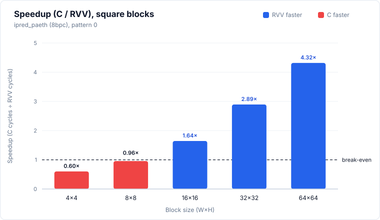
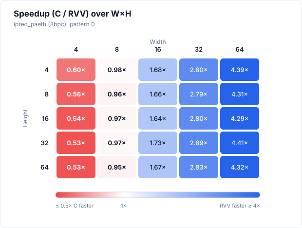
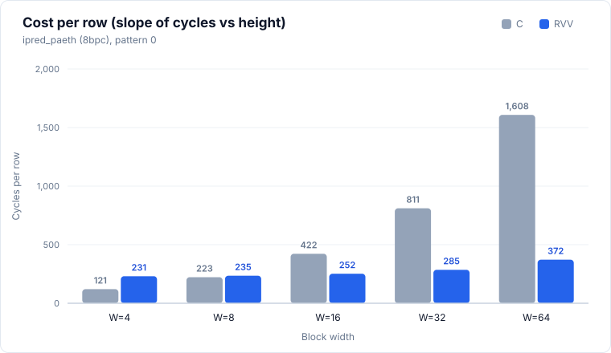

# ipred_paeth (8bpc)

> Status: **extracted; 25/25 cases bit-exact in the pasted simulation run** (memory model not stated, see Run configuration).



## Files and build

| File | Purpose |
|---|---|
| `ipred_paeth.S` | RVV routine, symbol `ipred_paeth_mock_r`. Ported from dav1d `ipred_paeth_8bpc_rvv`; per its header the instruction sequence is unchanged from upstream, only the function macros are stripped |
| `main.c` | scalar reference `ipred_paeth_mock_c`, harness |
| `res/results.csv` | the pasted results, one row per printed row |

Build and run:

```bash
make -C apps bin/ipred_paeth
make spike run ipred_paeth
make simv -app=ipred_paeth
```

## Harness notes

- Sweep: every W×H combination with W, H in {4, 8, 16, 32, 64} (25 cases), W in the outer loop. `stride = W`.
- Input: `topleft[-H .. W]` is a sawtooth, `20 + ((i + H) × 5) mod 200` with 3 added at odd `(i + H)`. `main.c` says this is meant to exercise all three Paeth outcomes (left, top, top-left). The CSV does not show which outcomes were taken.
- Pattern: single pattern, the `pattern` column is always 0.
- Preconditions: none stated in `main.c`. The `.S` loops one row at a time, so H is not required to be even or a multiple of 4.
- Row processing: the `.S` handles one row per outer iteration and splits a row into chunks with `vsetvli e8, m1`. With VLEN 1024 a chunk holds 128 elements, so every width in the sweep is one chunk per row.
- Warm-up: none. `main.c` makes one timed C call and one timed RVV call per case.
- Output buffers are zeroed before each case.

## Results

### Run configuration

| Item | Value |
|---|---|
| Simulator | Ara RTL on Verilator |
| Lanes | 4 |
| VLEN | 1024 |
| Memory model | not stated |
| Toolchain / flags | clang -O3 -fno-vectorize (C baseline) |
| Date | not stated |
| Harness | one timed call each of C and RVV, no warm-up call |

Level 0/1 numbers taken without a warm-up are not strictly comparable with runs that used one (for example `ipred_smooth`).

### Correctness

**25/25 PASS** (bit-exact against the scalar C reference, single pattern, all 25 sizes).

### Square blocks (headline)

| Size (W×H) | C cycles | RVV cycles | Speedup (C/RVV) | RVV cyc/px | C cyc/px | Status |
|---|---:|---:|---:|---:|---:|---|
| 4×4 | 582 | 968 | **0.60×** | 60.50 | 36.38 | PASS |
| 8×8 | 1,799 | 1,878 | **0.96×** | 29.34 | 28.11 | PASS |
| 16×16 | 6,609 | 4,022 | 1.64× | 15.71 | 25.82 | PASS |
| 32×32 | 26,310 | 9,094 | 2.89× | 8.88 | 25.69 | PASS |
| 64×64 | 102,453 | 23,738 | 4.32× | 5.80 | 25.01 | PASS |

Speedup is C cycles / RVV cycles, bold when below 1. Cycles per pixel is cycles divided by W×H. The figures show the single pattern (0).


### Rectangular blocks (supplementary)

<details>
<summary>Full table, 20 rows</summary>

| Size (W×H) | C cycles | RVV cycles | Speedup (C/RVV) | RVV cyc/px | C cyc/px | Status |
|---|---:|---:|---:|---:|---:|---|
| 4×8 | 1,030 | 1,850 | **0.56×** | 57.81 | 32.19 | PASS |
| 4×16 | 1,986 | 3,698 | **0.54×** | 57.78 | 31.03 | PASS |
| 4×32 | 3,885 | 7,394 | **0.53×** | 57.77 | 30.35 | PASS |
| 4×64 | 7,809 | 14,786 | **0.53×** | 57.76 | 30.50 | PASS |
| 8×4 | 921 | 938 | **0.98×** | 29.31 | 28.78 | PASS |
| 8×16 | 3,627 | 3,758 | **0.97×** | 29.36 | 28.34 | PASS |
| 8×32 | 7,295 | 7,518 | **0.97×** | 29.37 | 28.50 | PASS |
| 8×64 | 14,266 | 15,038 | **0.95×** | 29.37 | 27.86 | PASS |
| 16×4 | 1,676 | 998 | 1.68× | 15.59 | 26.19 | PASS |
| 16×8 | 3,327 | 2,006 | 1.66× | 15.67 | 25.99 | PASS |
| 16×32 | 13,972 | 8,054 | 1.73× | 15.73 | 27.29 | PASS |
| 16×64 | 26,881 | 16,118 | 1.67× | 15.74 | 26.25 | PASS |
| 32×4 | 3,122 | 1,114 | 2.80× | 8.70 | 24.39 | PASS |
| 32×8 | 6,284 | 2,254 | 2.79× | 8.80 | 24.55 | PASS |
| 32×16 | 12,712 | 4,534 | 2.80× | 8.86 | 24.83 | PASS |
| 32×64 | 51,633 | 18,240 | 2.83× | 8.91 | 25.21 | PASS |
| 64×4 | 6,259 | 1,426 | 4.39× | 5.57 | 24.45 | PASS |
| 64×8 | 12,542 | 2,910 | 4.31× | 5.68 | 24.50 | PASS |
| 64×16 | 25,193 | 5,878 | 4.29× | 5.74 | 24.60 | PASS |
| 64×32 | 52,105 | 11,827 | 4.41× | 5.77 | 25.44 | PASS |

</details>



### Cost per row

Fit of `cycles = fixed + per_row × H` at each width, least squares over all five heights, pattern 0 (the only pattern). Five points per fit, so the fixed terms are only indicative. The RVV fixed term is negative at W=8, 16, 32 and 64. The C fixed term is negative at W=32 and 64.

| Width | Heights used | C per row | C fixed | RVV per row | RVV fixed |
|---:|---|---:|---:|---:|---:|
| 4 | 4, 8, 16, 32, 64 | 120.63 | 66.75 | 230.63 | 19.50 |
| 8 | 4, 8, 16, 32, 64 | 222.80 | 56.04 | 235.00 | -2.00 |
| 16 | 4, 8, 16, 32, 64 | 422.30 | 19.88 | 252.00 | -10.00 |
| 32 | 4, 8, 16, 32, 64 | 811.10 | -103.12 | 285.43 | -31.42 |
| 64 | 4, 8, 16, 32, 64 | 1608.17 | -172.12 | 371.90 | -67.21 |



### Observations

- RVV is slower than C at W=4 (0.53× to 0.60×) and at W=8 (0.95× to 0.98×). It is faster at W ≥ 16: 1.64× to 1.73× at W=16, 2.79× to 2.89× at W=32, 4.29× to 4.41× at W=64. The speedup crosses 1.0 between W=8 and W=16. Smallest speedup is 0.53× (4×32, 4×64), largest is 4.41× (64×32).
- At fixed width the speedup barely changes with height. The speedup is set by width.
- RVV cost per row grows slowly with width: 230.63, 235.00, 252.00, 285.43, 371.90 cycles for W = 4, 8, 16, 32, 64. RVV cyc/px falls from about 58 (W=4) to about 5.8 (W=64). RVV cycles for 4×H and 8×H are close (4×16: 3,698, 8×16: 3,758).
- C cost per row is roughly proportional to width (120.63, 222.80, 422.30, 811.10, 1608.17), 24.39 to 36.38 cyc/px across sizes, highest at W=4.
- 4×4 RVV (968) costs more than 8×4 (938), a larger block. It is the first row of the run and there was no warm-up, so it may be a cold-start outlier. C 4×4 (582) is below 8×4 (921), as expected.
- C at 16×32 is 27.29 cyc/px, above the other W=16 rows (25.82 to 26.25). C cycles for 16×32 are 2.11× those of 16×16 for twice the rows.
- No missing cells, no non-PASS rows.

### Hypothesis check

> TODO

### Caveats

- One run per case, no repeats, so no run-to-run spread is available.
- Memory model not stated.
- Catalogue entry pending, so no hypotheses are recorded yet.
- No Ara lowerings or workarounds in `ipred_paeth.S`; the header says the instruction sequence is unchanged from upstream. The header lists instructions to confirm as supported on Ara (`vmmv.m`, `vzext.vf4`, masked `vneg.v`, `vmslt.vx`, `vmsleu.vv`, `vmsgtu.vv`, `vmand.mm`, `vmerge.vxm`, `vwaddu.vx`, `vwsub.vx`). All 25 cases pass, so these ran correctly in this run.
- Each row chunk runs four `vsetvli` (e8 m1, e16 m2, e32 m4, e8 m1) and widens to e32 m4. Their share of the per-row cost was not measured.
- No warm-up call. The first case (4×4) may include cold-start effects.
- The figures and the fit use pattern 0, which is the only pattern.
