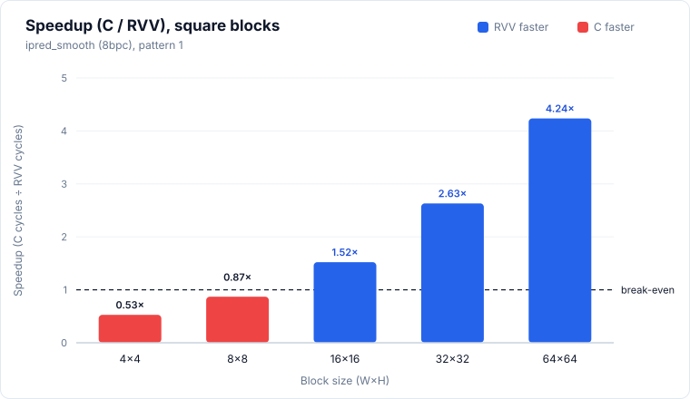
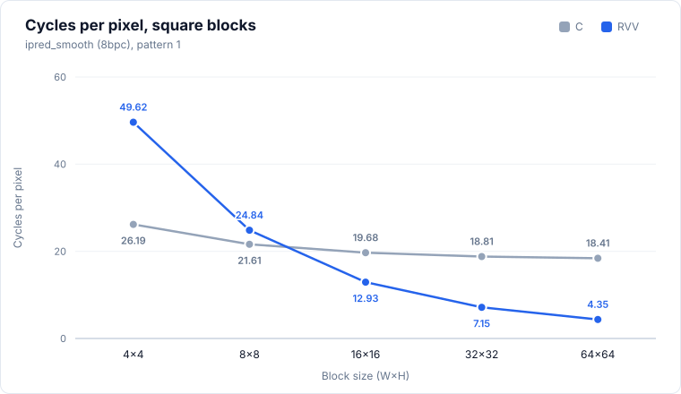
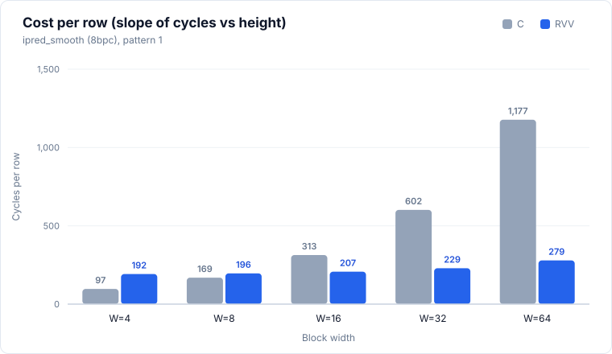

# ipred_smooth (8bpc)

> Status: **extracted; 38/38 cases bit-exact in the pasted simulation run** (VLEN, lanes and memory model not stated, see Run configuration).



## Files and build

| File | Purpose |
|---|---|
| `ipred_smooth.S` | RVV routine, symbol `ipred_smooth_mock_r` |
| `main.c` | scalar reference `ipred_smooth_mock_c`, harness, and the `dav1d_sm_weights[128]` table that the `.S` reads via `la` |
| `res/results.csv` | the pasted results, one row per printed row |

Build and run: 

```bash
make -C apps bin/ipred_smooth
make spike run ipred_smooth
make simv -app=ipred_smooth
```

## Results

### Run configuration

| Item | Value |
|---|---|
| Simulator | Ara simulation |
| Lanes | 4 |
| VLEN | 1024 |
| Memory model | - |
| Harness | one call each of C and RVV after a discarded warm-up call |


### Correctness

**38/38 PASS** (bit-exact against the scalar C reference, both patterns, all 19 sizes).

### Square blocks (headline)

| Size (W×H) | Pattern | C cycles | RVV cycles | Speedup (C/RVV) | RVV cyc/px | C cyc/px | Status |
|---|---|---:|---:|---:|---:|---:|---|
| 4×4 | 0 random | 500 | 811 | **0.62×** | 50.69 | 31.25 | PASS |
| 4×4 | 1 all-255 | 419 | 794 | **0.53×** | 49.62 | 26.19 | PASS |
| 8×8 | 0 random | 1,383 | 1,590 | **0.87×** | 24.84 | 21.61 | PASS |
| 8×8 | 1 all-255 | 1,383 | 1,590 | **0.87×** | 24.84 | 21.61 | PASS |
| 16×16 | 0 random | 5,039 | 3,310 | 1.52× | 12.93 | 19.68 | PASS |
| 16×16 | 1 all-255 | 5,039 | 3,310 | 1.52× | 12.93 | 19.68 | PASS |
| 32×32 | 0 random | 19,263 | 7,319 | 2.63× | 7.15 | 18.81 | PASS |
| 32×32 | 1 all-255 | 19,263 | 7,319 | 2.63× | 7.15 | 18.81 | PASS |
| 64×64 | 0 random | 75,417 | 17,801 | 4.24× | 4.35 | 18.41 | PASS |
| 64×64 | 1 all-255 | 75,417 | 17,801 | 4.24× | 4.35 | 18.41 | PASS |

Speedup is C cycles / RVV cycles, bold when below 1. Cycles per pixel is cycles divided by W×H.




### Rectangular blocks (supplementary)

<details>
<summary>Full table, 28 rows</summary>

| Size (W×H) | Pattern | C cycles | RVV cycles | Speedup (C/RVV) | RVV cyc/px | C cyc/px | Status |
|---|---|---:|---:|---:|---:|---:|---|
| 4×8 | 0 random | 807 | 1,562 | **0.52×** | 48.81 | 25.22 | PASS |
| 4×8 | 1 all-255 | 807 | 1,562 | **0.52×** | 48.81 | 25.22 | PASS |
| 4×16 | 0 random | 1,583 | 3,098 | **0.51×** | 48.41 | 24.73 | PASS |
| 4×16 | 1 all-255 | 1,583 | 3,098 | **0.51×** | 48.41 | 24.73 | PASS |
| 8×4 | 0 random | 707 | 806 | **0.88×** | 25.19 | 22.09 | PASS |
| 8×4 | 1 all-255 | 707 | 806 | **0.88×** | 25.19 | 22.09 | PASS |
| 8×16 | 0 random | 2,735 | 3,158 | **0.87×** | 24.67 | 21.37 | PASS |
| 8×16 | 1 all-255 | 2,735 | 3,158 | **0.87×** | 24.67 | 21.37 | PASS |
| 8×32 | 0 random | 5,439 | 6,294 | **0.86×** | 24.59 | 21.25 | PASS |
| 8×32 | 1 all-255 | 5,439 | 6,294 | **0.86×** | 24.59 | 21.25 | PASS |
| 16×4 | 0 random | 1,283 | 838 | 1.53× | 13.09 | 20.05 | PASS |
| 16×4 | 1 all-255 | 1,283 | 838 | 1.53× | 13.09 | 20.05 | PASS |
| 16×8 | 0 random | 2,535 | 1,662 | 1.53× | 12.98 | 19.80 | PASS |
| 16×8 | 1 all-255 | 2,535 | 1,662 | 1.53× | 12.98 | 19.80 | PASS |
| 16×32 | 0 random | 10,060 | 6,645 | 1.51× | 12.98 | 19.65 | PASS |
| 16×32 | 1 all-255 | 10,060 | 6,645 | 1.51× | 12.98 | 19.65 | PASS |
| 16×64 | 0 random | 20,088 | 13,249 | 1.52× | 12.94 | 19.62 | PASS |
| 16×64 | 1 all-255 | 20,088 | 13,249 | 1.52× | 12.94 | 19.62 | PASS |
| 32×8 | 0 random | 4,839 | 1,821 | 2.66× | 7.11 | 18.90 | PASS |
| 32×8 | 1 all-255 | 4,839 | 1,821 | 2.66× | 7.11 | 18.90 | PASS |
| 32×16 | 0 random | 9,660 | 3,671 | 2.63× | 7.17 | 18.87 | PASS |
| 32×16 | 1 all-255 | 9,660 | 3,671 | 2.63× | 7.17 | 18.87 | PASS |
| 32×64 | 0 random | 38,540 | 14,656 | 2.63× | 7.16 | 18.82 | PASS |
| 32×64 | 1 all-255 | 38,540 | 14,656 | 2.63× | 7.16 | 18.82 | PASS |
| 64×16 | 0 random | 18,903 | 4,424 | 4.27× | 4.32 | 18.46 | PASS |
| 64×16 | 1 all-255 | 18,903 | 4,424 | 4.27× | 4.32 | 18.46 | PASS |
| 64×32 | 0 random | 37,758 | 8,856 | 4.26× | 4.32 | 18.44 | PASS |
| 64×32 | 1 all-255 | 37,758 | 8,856 | 4.26× | 4.32 | 18.44 | PASS |

</details>



### Cost per row

Fit of `cycles = fixed + per_row × H` at each width that has at least three heights, using the pattern-1 rows (identical to pattern 0 except for the first case, see Observations). Three to five points per fit, so the fixed terms are only indicative (the RVV fixed term is negative at W=32 and 64).

| Width | Heights used | C per row | C fixed | RVV per row | RVV fixed |
|---:|---|---:|---:|---:|---:|
| 4 | 4, 8, 16 | 97 | 31 | 192 | 26 |
| 8 | 4, 8, 16, 32 | 169 | 31 | 196 | 22 |
| 16 | 4, 8, 16, 32, 64 | 313 | 27 | 207 | 8 |
| 32 | 8, 16, 32, 64 | 602 | 24 | 229 | -5 |
| 64 | 16, 32, 64 | 1177 | 73 | 279 | -49 |



### Observations

> TODO: Make Observations for Week 4 and Onwards.

### Hypothesis check

> TODO: Add Applicable Hypothesis after Synthesis.

