# ipred_smooth_h (8bpc)

> Status: **extracted; 38/38 cases bit-exact in the pasted simulation run** (memory model not stated, see Run configuration).


The figures show one pattern: pattern 1 (all edge pixels 255).

## Files and build

| File | Purpose |
|---|---|
| `ipred_smooth_h.S` | RVV routine, symbol `ipred_smooth_h_mock_r` (not reviewed for this README) |
| `main.c` | scalar reference `ipred_smooth_h_mock_c`, harness, `dav1d_sm_weights` table |
| `res/results.csv` | the pasted results, one row per printed row |

Build and run:

```bash
make -C apps bin/ipred_smooth_h
make spike run ipred_smooth_h
make simv -app=ipred_smooth_h
```

## Harness notes

- Sweep: 19 sizes, W=4 with H in {4, 8, 16}; W=8 with H in {4, 8, 16, 32}; W=16 with H in {4, 8, 16, 32, 64}; W=32 with H in {8, 16, 32, 64}; W=64 with H in {16, 32, 64}. `stride = W`. Each size prints twice, pattern 0 first, then pattern 1 (same convention as `ipred_smooth`).
- Pattern column: `0` = xorshift pseudo-random edge pixels over 0..255, with the right pixel fixed to 251 and the last left pixel fixed to 3. `1` = every edge pixel is 255.
- Input: pattern 0 mixes two different values with every horizontal weight and rounds both up and down in `(pred + 128) >> 8`. Pattern 1 drives the 16-bit sum in the asm to its maximum, 255 × 256 = 65,280 (65,408 with the rounding constant), and the expected output is 255 everywhere. `main.c` says smooth_h has no data-dependent branch.
- Preconditions: the kernel reads `topleft[-(y+1)]` for each row and `topleft[width]`. The top row `topleft[0 .. width-1]` is never read; `main.c` still fills it so a wrong read would change the output. `a`, `max_width` and `max_height` are unused.
- Warm-up: yes. One discarded call of C and one of RVV on a scratch buffer, then one timed call each.
- Output buffers are zeroed before the timed calls.

## Results

### Run configuration

| Item | Value |
|---|---|
| Simulator | Ara RTL on Verilator |
| Lanes | 4 |
| VLEN | 1024 |
| Memory model | not stated |
| Toolchain / flags | clang -O3 -fno-vectorize (C baseline) |
| Date | not stated |
| Harness | one discarded warm-up call each of C and RVV, then one timed call each |

### Correctness

**38/38 PASS** (bit-exact against the scalar C reference, both patterns, all 19 sizes).

### Square blocks (headline)

| Size (W×H) | Pattern | C cycles | RVV cycles | Speedup (C/RVV) | RVV cyc/px | C cyc/px | Status |
|---|---|---:|---:|---:|---:|---:|---|
| 4×4 | random | 406 | 304 | 1.34× | 19.00 | 25.38 | PASS |
| 4×4 | all 255 | 331 | 282 | 1.17× | 17.62 | 20.69 | PASS |
| 8×8 | random | 1,127 | 567 | 1.99× | 8.86 | 17.61 | PASS |
| 8×8 | all 255 | 1,127 | 567 | 1.99× | 8.86 | 17.61 | PASS |
| 16×16 | random | 4,159 | 1,247 | 3.34× | 4.87 | 16.25 | PASS |
| 16×16 | all 255 | 4,159 | 1,247 | 3.34× | 4.87 | 16.25 | PASS |
| 32×32 | random | 16,010 | 3,118 | 5.13× | 3.04 | 15.63 | PASS |
| 32×32 | all 255 | 16,010 | 3,118 | 5.13× | 3.04 | 15.63 | PASS |
| 64×64 | random | 62,729 | 8,577 | 7.31× | 2.09 | 15.31 | PASS |
| 64×64 | all 255 | 62,729 | 8,577 | 7.31× | 2.09 | 15.31 | PASS |

Speedup is C cycles / RVV cycles, bold when below 1. Cycles per pixel is cycles divided by W×H. The figures show pattern 1 (all 255).


### Rectangular blocks (supplementary)

<details>
<summary>Full table, 28 rows</summary>

| Size (W×H) | Pattern | C cycles | RVV cycles | Speedup (C/RVV) | RVV cyc/px | C cyc/px | Status |
|---|---|---:|---:|---:|---:|---:|---|
| 4×8 | random | 647 | 546 | 1.18× | 17.06 | 20.22 | PASS |
| 4×8 | all 255 | 647 | 546 | 1.18× | 17.06 | 20.22 | PASS |
| 4×16 | random | 1,279 | 1,067 | 1.20× | 16.67 | 19.98 | PASS |
| 4×16 | all 255 | 1,279 | 1,067 | 1.20× | 16.67 | 19.98 | PASS |
| 8×4 | random | 571 | 287 | 1.99× | 8.97 | 17.84 | PASS |
| 8×4 | all 255 | 571 | 287 | 1.99× | 8.97 | 17.84 | PASS |
| 8×16 | random | 2,239 | 1,127 | 1.99× | 8.80 | 17.49 | PASS |
| 8×16 | all 255 | 2,239 | 1,127 | 1.99× | 8.80 | 17.49 | PASS |
| 8×32 | random | 4,463 | 2,247 | 1.99× | 8.78 | 17.43 | PASS |
| 8×32 | all 255 | 4,463 | 2,256 | 1.98× | 8.81 | 17.43 | PASS |
| 16×4 | random | 1,051 | 311 | 3.38× | 4.86 | 16.42 | PASS |
| 16×4 | all 255 | 1,051 | 311 | 3.38× | 4.86 | 16.42 | PASS |
| 16×8 | random | 2,087 | 623 | 3.35× | 4.87 | 16.30 | PASS |
| 16×8 | all 255 | 2,087 | 623 | 3.35× | 4.87 | 16.30 | PASS |
| 16×32 | random | 8,316 | 2,495 | 3.33× | 4.87 | 16.24 | PASS |
| 16×32 | all 255 | 8,316 | 2,495 | 3.33× | 4.87 | 16.24 | PASS |
| 16×64 | random | 16,604 | 4,991 | 3.33× | 4.87 | 16.21 | PASS |
| 16×64 | all 255 | 16,604 | 4,991 | 3.33× | 4.87 | 16.21 | PASS |
| 32×8 | random | 4,007 | 766 | 5.23× | 2.99 | 15.65 | PASS |
| 32×8 | all 255 | 4,007 | 766 | 5.23× | 2.99 | 15.65 | PASS |
| 32×16 | random | 8,026 | 1,550 | 5.18× | 3.03 | 15.68 | PASS |
| 32×16 | all 255 | 8,026 | 1,550 | 5.18× | 3.03 | 15.68 | PASS |
| 32×64 | random | 31,995 | 6,279 | 5.10× | 3.07 | 15.62 | PASS |
| 32×64 | all 255 | 31,995 | 6,279 | 5.10× | 3.07 | 15.62 | PASS |
| 64×16 | random | 15,729 | 2,094 | 7.51× | 2.04 | 15.36 | PASS |
| 64×16 | all 255 | 15,729 | 2,094 | 7.51× | 2.04 | 15.36 | PASS |
| 64×32 | random | 31,393 | 4,250 | 7.39× | 2.08 | 15.33 | PASS |
| 64×32 | all 255 | 31,393 | 4,250 | 7.39× | 2.08 | 15.33 | PASS |

</details>



### Cost per row

Fit of `cycles = fixed + per_row × H` at each width that has at least three heights, using the pattern-1 (all 255) rows, the same pattern as the figures. Three to five points per fit, so the fixed terms are only indicative. The RVV fixed term is negative at W=16, 32 and 64.

| Width | Heights used | C per row | C fixed | RVV per row | RVV fixed |
|---:|---|---:|---:|---:|---:|
| 4 | 4, 8, 16 | 79.00 | 15.00 | 65.38 | 21.50 |
| 8 | 4, 8, 16, 32 | 139.00 | 15.00 | 70.33 | 4.26 |
| 16 | 4, 8, 16, 32, 64 | 259.25 | 13.92 | 78.00 | -1.00 |
| 32 | 8, 16, 32, 64 | 499.64 | 20.39 | 98.46 | -25.61 |
| 64 | 16, 32, 64 | 979.18 | 61.00 | 135.08 | -69.50 |


### Observations

- RVV is faster than C in all 38 rows, so there is no speedup crossover. Smallest speedup is 1.17× (4×4, all 255), largest is 7.51× (64×16).
- Square speedup rises with size: 1.17× (4×4, all 255; 1.34× random), 1.99×, 3.34×, 5.13×, 7.31× for 4 to 64.
- At fixed width the speedup barely changes with height. It is set by width: 1.17× to 1.34× at W=4, 1.98× to 1.99× at W=8, 3.33× to 3.38× at W=16, 5.10× to 5.23× at W=32, 7.31× to 7.51× at W=64.
- RVV cost per row grows with width: 65.38, 70.33, 78.00, 98.46, 135.08 cycles for W = 4, 8, 16, 32, 64. RVV cyc/px falls from about 17 (W=4) to about 2.1 (W=64). C cost per row is roughly proportional to width (79.00, 139.00, 259.25, 499.64, 979.18), 15.31 to 20.22 cyc/px except 4×4.
- Both patterns give identical cycles at 17 of the 19 sizes. The two sizes that differ are 4×4 (C 406 against 331, RVV 304 against 282) and 8×32 (RVV 2,247 against 2,256). `main.c` says the kernel has no data-dependent branch. A warm-up call was used, so the 4×4 difference is not an obvious cold-start effect. The cause is not shown by this data.
- RVV 4×4 random (304) costs more than 8×4 (287), a larger block. RVV 4×4 all 255 (282) does not.
- No missing cells, no non-PASS rows.

### Hypothesis check

> TODO

