# ipred_smooth_v (8bpc)

> Status: **extracted; 38/38 cases bit-exact in the pasted simulation run** (memory model not stated, see Run configuration).


The figures show one pattern: pattern 1 (the second row of each size in the pasted output).

## Files and build

| File | Purpose |
|---|---|
| `ipred_smooth_v.S` | RVV routine, symbol `ipred_smooth_v_mock_r` (not attached, not reviewed for this README) |
| `main.c` | scalar reference, harness (not attached, not reviewed for this README) |
| `res/results.csv` | the pasted results, one row per printed row |

Build and run:

```bash
make -C apps bin/ipred_smooth_v
make spike run ipred_smooth_v
make simv -app=ipred_smooth_v
```

## Harness notes

`main.c` was not attached, so these come from the pasted output only.

- Sweep: 19 sizes, W=4 with H in {4, 8, 16}; W=8 with H in {4, 8, 16, 32}; W=16 with H in {4, 8, 16, 32, 64}; W=32 with H in {8, 16, 32, 64}; W=64 with H in {16, 32, 64}. The same size list as `ipred_smooth_h`.
- Each size prints twice. Pattern `0` is the first row and pattern `1` the second row of each size. What the two input patterns are: not stated.
- Preconditions, input data and branches exercised: not stated.
- Warm-up: not stated.

## Results

### Run configuration

| Item | Value |
|---|---|
| Simulator | Ara RTL on Verilator |
| Lanes | 4 |
| VLEN | 1024 |
| Memory model | not stated |
| Toolchain / flags | clang -O3 -fno-vectorize (C baseline) |
| Date | not stated |
| Harness | warm-up call not stated |

### Correctness

**38/38 PASS** (bit-exact against the scalar C reference, both patterns, all 19 sizes).

### Square blocks (headline)

| Size (W×H) | Pattern | C cycles | RVV cycles | Speedup (C/RVV) | RVV cyc/px | C cyc/px | Status |
|---|---|---:|---:|---:|---:|---:|---|
| 4×4 | 0 | 347 | 449 | **0.77×** | 28.06 | 21.69 | PASS |
| 4×4 | 1 | 279 | 415 | **0.67×** | 25.94 | 17.44 | PASS |
| 8×8 | 0 | 895 | 847 | 1.06× | 13.23 | 13.98 | PASS |
| 8×8 | 1 | 895 | 847 | 1.06× | 13.23 | 13.98 | PASS |
| 16×16 | 0 | 3,183 | 1,855 | 1.72× | 7.25 | 12.43 | PASS |
| 16×16 | 1 | 3,183 | 1,855 | 1.72× | 7.25 | 12.43 | PASS |
| 32×32 | 0 | 11,983 | 4,392 | 2.73× | 4.29 | 11.70 | PASS |
| 32×32 | 1 | 11,983 | 4,392 | 2.73× | 4.29 | 11.70 | PASS |
| 64×64 | 0 | 46,540 | 11,586 | 4.02× | 2.83 | 11.36 | PASS |
| 64×64 | 1 | 46,540 | 11,586 | 4.02× | 2.83 | 11.36 | PASS |

Speedup is C cycles / RVV cycles, bold when below 1. Cycles per pixel is cycles divided by W×H. The figures show pattern 1.


### Rectangular blocks (supplementary)

<details>
<summary>Full table, 28 rows</summary>

| Size (W×H) | Pattern | C cycles | RVV cycles | Speedup (C/RVV) | RVV cyc/px | C cyc/px | Status |
|---|---|---:|---:|---:|---:|---:|---|
| 4×8 | 0 | 543 | 819 | **0.66×** | 25.59 | 16.97 | PASS |
| 4×8 | 1 | 543 | 819 | **0.66×** | 25.59 | 16.97 | PASS |
| 4×16 | 0 | 1,071 | 1,627 | **0.66×** | 25.42 | 16.73 | PASS |
| 4×16 | 1 | 1,071 | 1,627 | **0.66×** | 25.42 | 16.73 | PASS |
| 8×4 | 0 | 455 | 427 | 1.07× | 13.34 | 14.22 | PASS |
| 8×4 | 1 | 455 | 427 | 1.07× | 13.34 | 14.22 | PASS |
| 8×16 | 0 | 1,775 | 1,687 | 1.05× | 13.18 | 13.87 | PASS |
| 8×16 | 1 | 1,775 | 1,687 | 1.05× | 13.18 | 13.87 | PASS |
| 8×32 | 0 | 3,535 | 3,367 | 1.05× | 13.15 | 13.81 | PASS |
| 8×32 | 1 | 3,535 | 3,367 | 1.05× | 13.15 | 13.81 | PASS |
| 16×4 | 0 | 807 | 463 | 1.74× | 7.23 | 12.61 | PASS |
| 16×4 | 1 | 807 | 463 | 1.74× | 7.23 | 12.61 | PASS |
| 16×8 | 0 | 1,599 | 927 | 1.72× | 7.24 | 12.49 | PASS |
| 16×8 | 1 | 1,599 | 927 | 1.72× | 7.24 | 12.49 | PASS |
| 16×32 | 0 | 6,351 | 3,750 | 1.69× | 7.32 | 12.40 | PASS |
| 16×32 | 1 | 6,351 | 3,750 | 1.69× | 7.32 | 12.40 | PASS |
| 16×64 | 0 | 12,698 | 7,475 | 1.70× | 7.30 | 12.40 | PASS |
| 16×64 | 1 | 12,698 | 7,475 | 1.70× | 7.30 | 12.40 | PASS |
| 32×8 | 0 | 3,007 | 1,078 | 2.79× | 4.21 | 11.75 | PASS |
| 32×8 | 1 | 3,007 | 1,078 | 2.79× | 4.21 | 11.75 | PASS |
| 32×16 | 0 | 5,999 | 2,200 | 2.73× | 4.30 | 11.72 | PASS |
| 32×16 | 1 | 5,999 | 2,200 | 2.73× | 4.30 | 11.72 | PASS |
| 32×64 | 0 | 23,986 | 8,789 | 2.73× | 4.29 | 11.71 | PASS |
| 32×64 | 1 | 23,986 | 8,789 | 2.73× | 4.29 | 11.71 | PASS |
| 64×16 | 0 | 11,645 | 2,872 | 4.05× | 2.80 | 11.37 | PASS |
| 64×16 | 1 | 11,645 | 2,872 | 4.05× | 2.80 | 11.37 | PASS |
| 64×32 | 0 | 23,296 | 5,755 | 4.05× | 2.81 | 11.38 | PASS |
| 64×32 | 1 | 23,296 | 5,755 | 4.05× | 2.81 | 11.38 | PASS |

</details>



### Cost per row

Fit of `cycles = fixed + per_row × H` at each width that has at least three heights, using the pattern-1 rows, the same pattern as the figures. Three to five points per fit, so the fixed terms are only indicative. The RVV fixed term is negative at W=16, 32 and 64.

| Width | Heights used | C per row | C fixed | RVV per row | RVV fixed |
|---:|---|---:|---:|---:|---:|
| 4 | 4, 8, 16 | 66.00 | 15.00 | 101.00 | 11.00 |
| 8 | 4, 8, 16, 32 | 110.00 | 15.00 | 105.00 | 7.00 |
| 16 | 4, 8, 16, 32, 64 | 198.18 | 12.71 | 116.97 | -6.96 |
| 32 | 8, 16, 32, 64 | 374.65 | 4.35 | 137.55 | -11.78 |
| 64 | 16, 32, 64 | 726.89 | 23.00 | 181.64 | -43.50 |


### Observations

- RVV is slower than C at W=4 (0.66× to 0.77×) and only just faster at W=8 (1.05× to 1.07×). It is faster at W ≥ 16: 1.69× to 1.74× at W=16, 2.73× to 2.79× at W=32, 4.02× to 4.05× at W=64. The speedup crosses 1.0 between W=4 and W=8. Smallest speedup is 0.66× (4×8 and 4×16), largest is 4.05× (64×16, 64×32).
- Square speedup rises with size: 0.77× (4×4, pattern 0; 0.67× pattern 1), 1.06×, 1.72×, 2.73×, 4.02× for 4 to 64.
- At fixed width the speedup barely changes with height. It is set by width.
- RVV cost per row grows slowly with width: 101.00, 105.00, 116.97, 137.55, 181.64 cycles for W = 4, 8, 16, 32, 64. RVV cyc/px falls from about 26 to 28 at 4×4 to 2.83 at 64×64. C cost per row grows with width (66.00, 110.00, 198.18, 374.65, 726.89), 11.36 to 14.22 cyc/px for W ≥ 8.
- At W=4 and W=8 the RVV cost per row is nearly the same (101.00 and 105.00), while C per row is 66.00 and 110.00. This is where the break-even sits.
- Both patterns give identical cycles at 18 of the 19 sizes. Only 4×4 differs (C 347 against 279, RVV 449 against 415). 4×4 is the first case of the run, and the warm-up is not stated, so a cold-start effect is possible but not shown.
- RVV 4×4 pattern 0 (449) costs more than 8×4 (427), a larger block. RVV 4×4 pattern 1 (415) does not.
- No missing cells, no non-PASS rows.

### Hypothesis check

> TODO

### Caveats

- One run per case, no repeats, so no run-to-run spread is available.
- Memory model not stated.
- `ipred_smooth_v.S` and `main.c` were not attached, so there is no catalogue entry, no hypotheses, and the pattern meanings, harness preconditions, warm-up and Ara workarounds are not stated.
- The figures and the fit use pattern 1.
