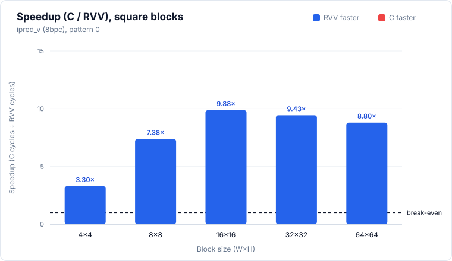
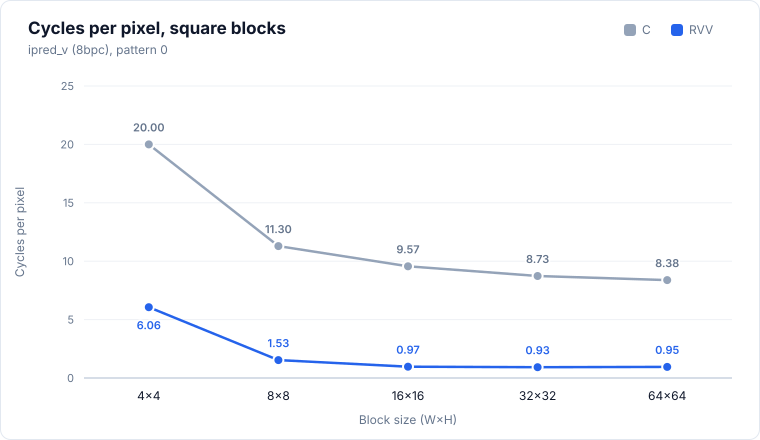
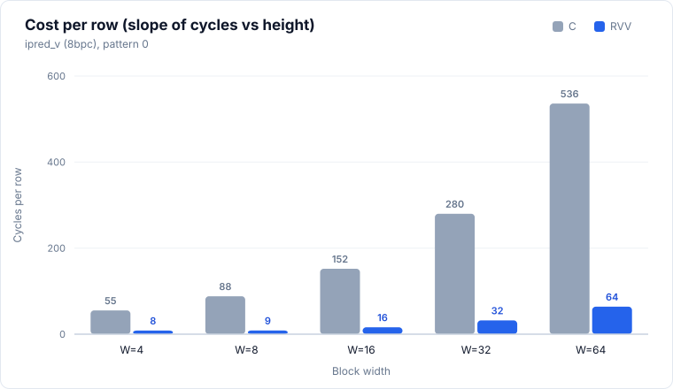

# ipred_v (8bpc)

> Status: **extracted; 25/25 cases bit-exact in the pasted simulation run** (memory model not stated, see Run configuration).



## Files and build

| File | Purpose |
|---|---|
| `ipred_v.S` | RVV routine, symbol `ipred_v_mock_r` |
| `main.c` | scalar reference `ipred_v_mock_c`, harness |
| `res/results.csv` | the pasted results, one row per printed row |

Build and run:

```bash
make -C apps bin/ipred_v
make spike run ipred_v
make simv -app=ipred_v
```

## Harness notes

- Sweep: every W×H combination with W, H in {4, 8, 16, 32, 64} (25 cases). `stride = W`.
- Input: `topleft[j] = j + 10` for j = 0..W. The output must equal `topleft[1..W]` repeated on every row.
- Pattern: single pattern, the `pattern` column is always 0. There is no data-dependent branch to exercise.
- Preconditions: H is even (the fast loop steps by 2 rows). All heights in the sweep are even.
- Paths in the `.S`: width fits in LMUL=1 (fast loop, 2 rows per iteration), else LMUL=2 (same fast loop), else column loop with one row per iteration. With VLEN 1024 and e8, `vsetvli` grants up to 128 elements at LMUL=1, so every width in the sweep (max 64) takes the fast loop. The column loop is not exercised.
- Warm-up: none. `main.c` makes one timed C call and one timed RVV call per case, no discarded call before them.
- Output buffers are zeroed before each case.

## Results

### Run configuration

| Item | Value |
|---|---|
| Simulator | Ara RTL on Verilator |
| Lanes | 4 |
| VLEN | 1024 |
| Memory model | not stated |
| Toolchain / flags | clang -O3 -fno-vectorize (C baseline) |
| Date | not stated |
| Harness | one timed call each of C and RVV, no warm-up call |

Level 0/1 numbers taken without a warm-up are not strictly comparable with runs that used one (for example `ipred_smooth`).

### Correctness

**25/25 PASS** (bit-exact against the scalar C reference, single pattern, all 25 sizes).

### Square blocks (headline)

| Size (W×H) | C cycles | RVV cycles | Speedup (C/RVV) | RVV cyc/px | C cyc/px | Status |
|---|---:|---:|---:|---:|---:|---|
| 4×4 | 320 | 97 | 3.30× | 6.06 | 20.00 | PASS |
| 8×8 | 723 | 98 | 7.38× | 1.53 | 11.30 | PASS |
| 16×16 | 2,449 | 248 | 9.88× | 0.97 | 9.57 | PASS |
| 32×32 | 8,941 | 948 | 9.43× | 0.93 | 8.73 | PASS |
| 64×64 | 34,331 | 3,903 | 8.80× | 0.95 | 8.38 | PASS |

Speedup is C cycles / RVV cycles, bold when below 1. Cycles per pixel is cycles divided by W×H. The figures show the single pattern (0).




### Rectangular blocks (supplementary)

<details>
<summary>Full table, 20 rows</summary>

| Size (W×H) | C cycles | RVV cycles | Speedup (C/RVV) | RVV cyc/px | C cyc/px | Status |
|---|---:|---:|---:|---:|---:|---|
| 4×8 | 495 | 114 | 4.34× | 3.56 | 15.47 | PASS |
| 4×16 | 937 | 176 | 5.32× | 2.75 | 14.64 | PASS |
| 4×32 | 1,809 | 324 | 5.58× | 2.53 | 14.13 | PASS |
| 4×64 | 3,614 | 589 | 6.14× | 2.30 | 14.12 | PASS |
| 8×4 | 351 | 65 | 5.40× | 2.03 | 10.97 | PASS |
| 8×16 | 1,425 | 166 | 8.58× | 1.30 | 11.13 | PASS |
| 8×32 | 2,797 | 297 | 9.42× | 1.16 | 10.93 | PASS |
| 8×64 | 5,662 | 583 | 9.71× | 1.14 | 11.06 | PASS |
| 16×4 | 607 | 66 | 9.20× | 1.03 | 9.48 | PASS |
| 16×8 | 1,235 | 120 | 10.29× | 0.94 | 9.65 | PASS |
| 16×32 | 4,845 | 499 | 9.71× | 0.97 | 9.46 | PASS |
| 16×64 | 9,749 | 1,025 | 9.51× | 1.00 | 9.52 | PASS |
| 32×4 | 1,132 | 67 | 16.90× | 0.52 | 8.84 | PASS |
| 32×8 | 2,259 | 185 | 12.21× | 0.72 | 8.82 | PASS |
| 32×16 | 4,487 | 441 | 10.17× | 0.86 | 8.76 | PASS |
| 32×64 | 17,931 | 1,983 | 9.04× | 0.97 | 8.76 | PASS |
| 64×4 | 2,160 | 70 | 30.86× | 0.27 | 8.44 | PASS |
| 64×8 | 4,307 | 313 | 13.76× | 0.61 | 8.41 | PASS |
| 64×16 | 8,583 | 825 | 10.40× | 0.81 | 8.38 | PASS |
| 64×32 | 17,133 | 1,844 | 9.29× | 0.90 | 8.37 | PASS |

</details>



### Cost per row

Fit of `cycles = fixed + per_row × H` at each width, least squares over all five heights, pattern 0 (the only pattern). Five points per fit, so the fixed terms are only indicative. The RVV fixed term is negative at W=16, 32 and 64.

| Width | Heights used | C per row | C fixed | RVV per row | RVV fixed |
|---:|---|---:|---:|---:|---:|
| 4 | 4, 8, 16, 32, 64 | 55.22 | 65.46 | 8.38 | 52.29 |
| 8 | 4, 8, 16, 32, 64 | 88.25 | 3.04 | 8.62 | 27.92 |
| 16 | 4, 8, 16, 32, 64 | 152.10 | 4.92 | 16.05 | -6.33 |
| 32 | 4, 8, 16, 32, 64 | 279.86 | 9.50 | 32.00 | -68.71 |
| 64 | 4, 8, 16, 32, 64 | 536.09 | 7.83 | 63.97 | -195.46 |



### Observations

- RVV is faster than C in all 25 cases. Smallest speedup is 3.30× (4×4), largest is 30.86× (64×4).
- Square speedup rises from 3.30× (4×4) to 9.88× (16×16), then falls to 9.43× (32×32) and 8.80× (64×64).
- RVV cost per row is close to the width for W ≥ 16 (16.05, 32.00, 63.97 cycles for W = 16, 32, 64), and about 8.4 to 8.6 for W = 4 and 8. C per row grows roughly with width too (about 8.4 to 9.6 cyc/px at W ≥ 16).
- RVV cycles do not scale linearly with height at large widths. At W=64: 70, 313, 825, 1,844, 3,903 for H = 4, 8, 16, 32, 64. The 64×4 value (70) is far below the later per-row slope, and 32×4 (67) shows the same. This is why the fixed term is negative and why speedup drops with H at fixed W (64×4: 30.86×, 64×64: 8.80×). A possible cause is that the timed region ends before the last stores finish; this data does not show it.
- 4×4 RVV (97 cycles) costs more than 8×4 (65) and 16×4 (66), which are larger blocks. It is the first row of the run and there was no warm-up, so it may be a cold-start outlier.
- No missing cells, no non-PASS rows.

### Hypothesis check

> TODO

### Caveats

- One run per case, no repeats, so no run-to-run spread is available.
- Memory model not stated.
- Catalogue entry pending, so no hypotheses are recorded yet.
- No Ara workarounds appear in `ipred_v.S`. It uses only base RVV instructions (`vsetvli`, `vle8.v`, `vse8.v`) and scalar `add`/`slli`/`addi`.
- No warm-up call. The first case (4×4) may include cold-start effects.
- The figures and the fit use pattern 0, which is the only pattern.
